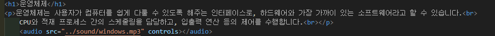
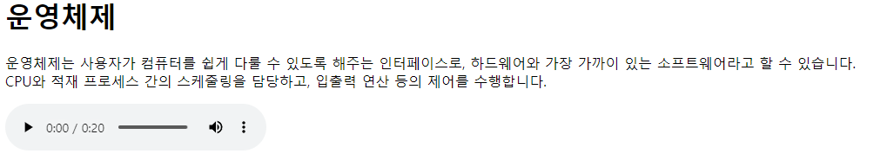
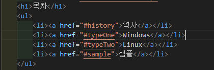
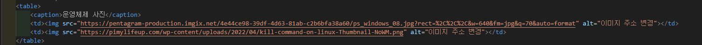
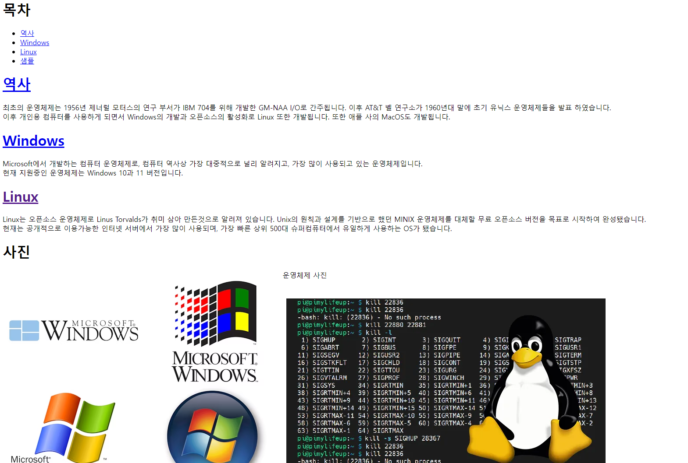
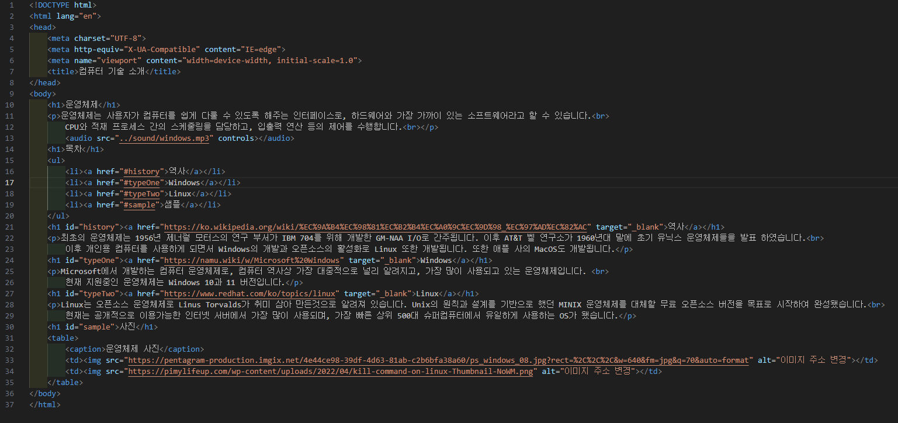
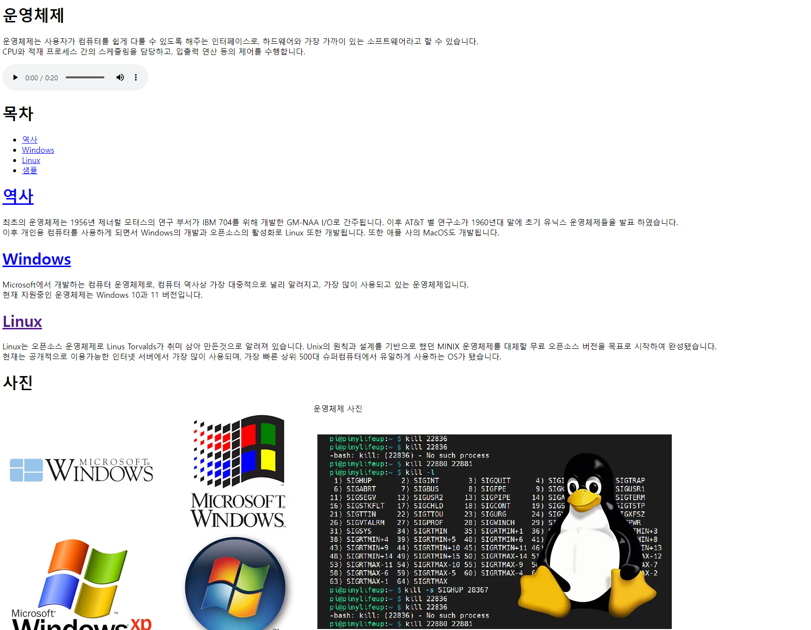

# 104페이지 OpenChallenge 02 번 문제

-----------------------------

## HTML 파일의 구성

> 교재에서 예시로 주어진 내용과는 조금 변경점을 주고 싶어 운영체제에 대한 내용으로 구성했습니다.
> 문제에서 제시한 조건 4개는 다음과 같습니다.

+ 웹 페이지 소개 오디오
+ 리스트, 표, 이미지
+ 목차 부분은 링크로 만들고 본문에 앵커를 만들어 연결
+ 관련 정보를 클릭하면 웹 페이지를 새 창이나 탭에 출력하도록 링크 작성

## 웹 페이지 소개 오디오
-----------------------------
> 웹 페이지 소개 오디오는 audio 태그와 예시 이미지의 컨트롤러를 사용하기 위한 controls 속성을 사용했습니다.

## 리스트, 표, 이미지
-----------------------------
> 리스트, 표, 이미지는 먼저, 목차에서 ul 태그를 통해 순서가 없는 리스트를 사용하였고, 샘플 부분에서 table 태그에 img 태그를 사용하여 표와 이미지를 삽입하였습니다.

## 목차 부분은 링크로 만들고 본문에 앵커를 만들어 연결
-----------------------------
> 목차 부분에 링크를 만들고 본문에 앵커를 만들어 연결하는 부분은 목차에서 각 리스트를 클릭하면 해당 내용이 있는 곳을 id 속성과 a 태그를 사용하여 연결했습니다.

> 세번째 조건과 마지막 조건의 코드 내용은 위 사진에 포함되어 있습니다.

## 관련 정보를 클릭하면 웹 페이지를 새 창이나 탭에 출력하도록 링크 작성
-----------------------------
> 마지막 조건인 관련 정보를 클릭하면 웹 페이지를 새 창이나 탭에 출력하는 링크는 a 태그에 target 속성을 _blank로 설정하여 해결했습니다.

## 완성된 웹페이지 및 코드
-----------------------------
> 다음은 완성된 웹페이지 사진과 코드 사진입니다.

