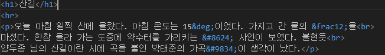
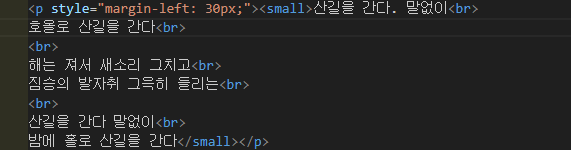
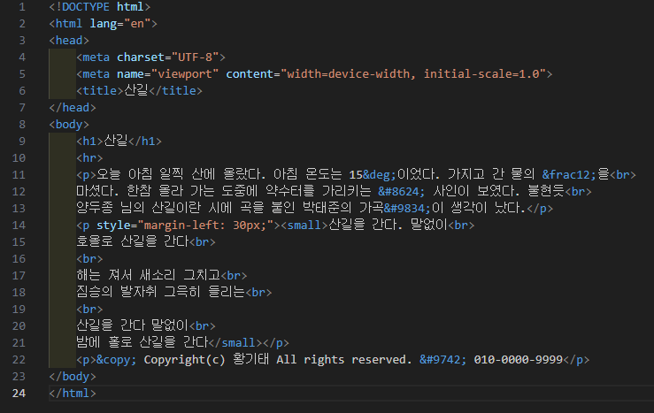
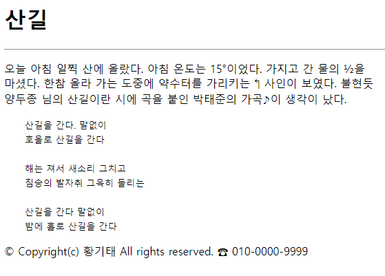

# 107페이지 실습문제 1번 문제

-----------------------------

## HTML 파일의 구성

> 문제에서 요구한 웹 페이지는 다음으로 구성되어야 합니다.
+ 제목
+ 내용에 유니코드 문자가 포함됨
+ 작은 글씨로된 내용 하나가 들여쓰기로 포함됨

## 제목

> 제목같은 경우에는 h1태그를 사용하여 구현했습니다.

## 내용에 유니코드가 포함됨
-----------------------------

> 내용을 작성하고, 유니코드같은 경우 &# 과 같은 코드를 이용하여 웹페이지 상에서 유니코드 문자로 보일 수 있게끔 처리했습니다.

## 작은 글씨로 된 내용 하나가 들여쓰기로 포함됨
-----------------------------

> 이 부분은 p 태그의 style 속성으로 margin-left를 30px 정도 밀어주어 모든 내용에 똑같이 들여쓰기를 넣어주었습니다. 작은 글씨는 small 태그를 통해 구현했습니다.

## 완성된 웹페이지 및 코드
-----------------------------

> 다음은 완성된 웹페이지 사진과 코드 사진입니다.

