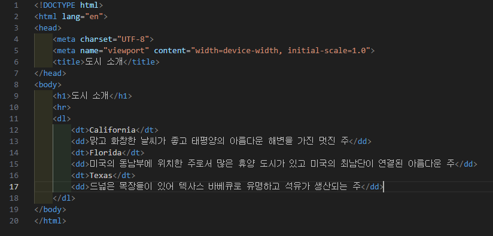
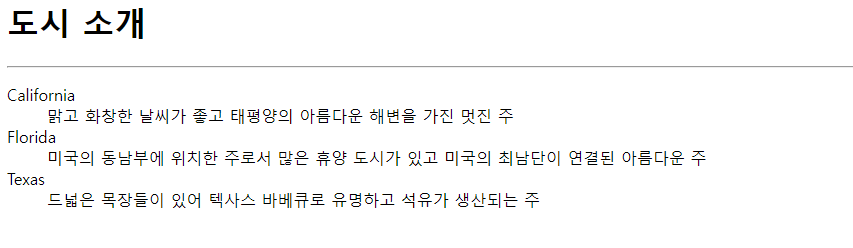
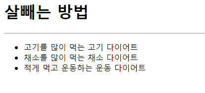
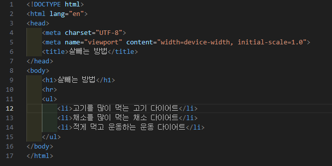

# 108페이지 실습문제 2번 문제

-----------------------------

## 2-1번 문제

-----------------------------

### HTML 파일의 구성
-----------------------------

> 해당 문제에서는 다음과 같은 조건으로 HTML 작성을 요구합니다.
+ 임의의 리스트로 내용을 작성

### 임의의 리스트로 내용을 작성
-----------------------------

> dl 태그와 dt 태그를 통해 리스트를 dt 태그의 내용으로 리스트를 작성하고 내용을 채워나가는 방식으로 구현했습니다.

### 완성된 웹페이지와 코드

> 다음은 완성된 웹페이지 사진과 코드 사진입니다.

## 2-2번 문제

-----------------------------

### HTML 파일의 구성
-----------------------------

> 해당 문제에서는 다음과 같은 조건으로 HTML 작성을 요구합니다.
+ 순서가 없는 리스트로 내용을 작성

### 순서가 없는 리스트로 내용을 작성

-----------------------------

> ul태그와 li 태그를 통해 리스트에 순서가 없게끔 구현하였습니다.

### 완성된 웹페이지와 코드

> 다음은 완성된 웹페이지 사진과 코드 사진입니다.

