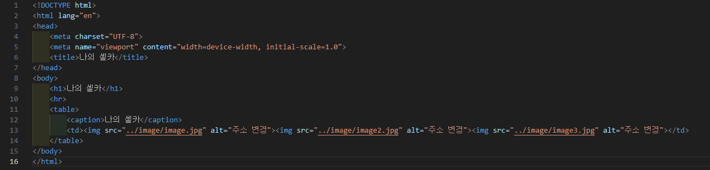
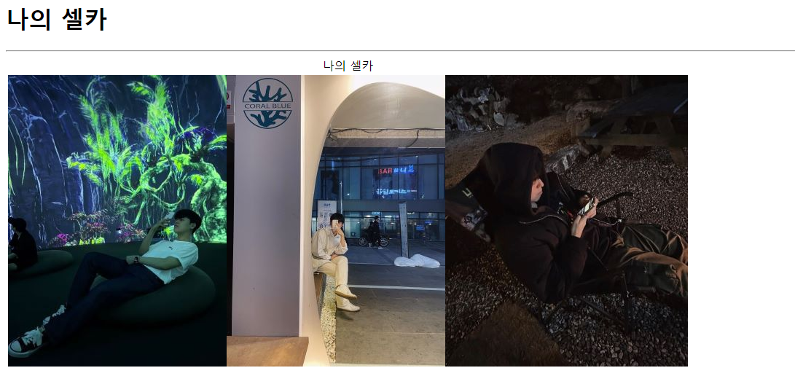

# 108페이지 실습문제 3번 문제

-----------------------------

## HTML 파일의 구성

-----------------------------

> 해당 문제에서는 다음과 같은 조건을 충족해야 합니다.
+ 사진 3장이 가로로 정렬
+ 사진들의 대표 제목

## 사진 3장이 가로로 정렬

-----------------------------

> 사진 3장을 table 태그에서 td 태그로 담아 사진들이 가로로 정렬되어있게끔 구현했습니다.

## 사진들의 대표 제목

-----------------------------

> 사진들의 대표 제목은 caption 태그를 통해 사진이 3장이상 들어가더라도 사진들의 중심에 출력되게끔 구현했습니다.

## 완성된 웹페이지와 코드

-----------------------------

> 다음은 완성된 웹페이지 사진과 코드 사진입니다.

