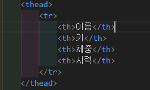
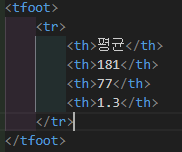
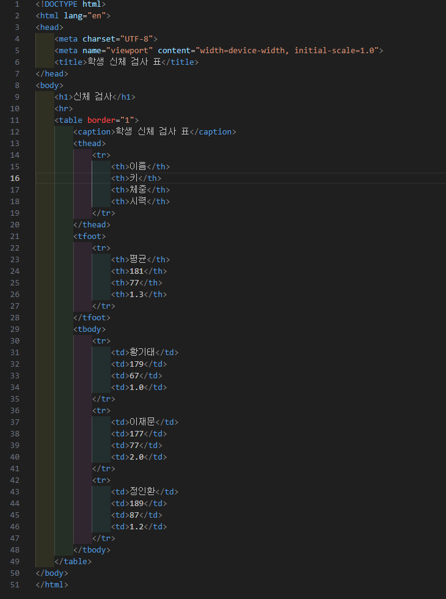
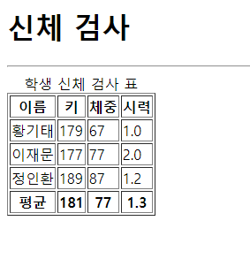
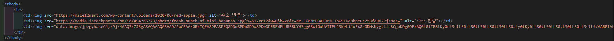
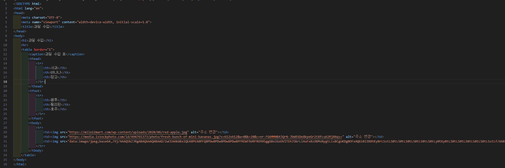
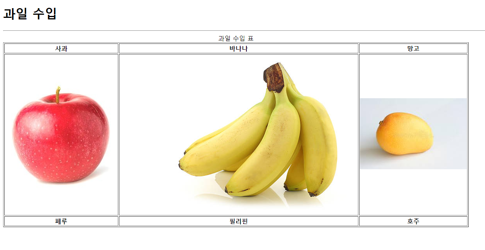

# 108페이지 실습문제 4번 문제

-----------------------------

## 4-1번 문제

-----------------------------

### HTML 파일의 구성

-----------------------------

> 해당 문제에서는 다음과 같은 조건을 충족해야합니다.
+ 테이블의 제목
+ 각 열의 제목
+ 각 열의 마지막
+ 테이블의 선 두께

### 테이블의 제목

-----------------------------

> 테이블의 제목은 table 태그 안에서 caption 태그를 사용하여 중심에 위치하게끔 구현했습니다.

### 각 열의 제목

-----------------------------

> 각 열의 제목은 thead 태그를 활용하여 열을 대표하는 행으로 보이게 구현했습니다.

### 각 열의 마지막

-----------------------------

> 각 열의 마지막 부분은 tfoot 태그를 통해 thead 태그와 비슷하게 마지막으로 보이게끔 구현했습니다.

### 테이블의 선 두께

-----------------------------

> 테이블의 선 두께는 table 태그의 border 속성을 1로 설정하여 구현했습니다.

### 완성된 웹페이지와 코드

-----------------------------

> 다음은 완성된 웹페이지 사진과 코드 사진입니다.

## 4-2번 문제

-----------------------------

### HTML 파일의 구성

-----------------------------

> 해당 문제에서는 다음과 같은 조건을 충족해야합니다.
+ 테이블의 제목
+ 테이블에 사진 삽입
+ 각 사진의 이름
+ 각 사진의 원산지

### 테이블의 제목

-----------------------------

> 테이블의 제목은 table 태그 안에 caption 태그를 사용하여 구현했습니다.

### 테이블에 사진 삽입

-----------------------------

> 테이블 내에서 사진 삽입은 td 태그 안에서 img 태그를 사용하여 사진이 테이블안에 존재하게끔 구현했습니다.

### 각 사진의 이름

-----------------------------

> 각 사진의 이름은 thead 태그를 통해 구현했습니다.

### 각 사진의 원산지

-----------------------------

> 각 사진의 원산지는 tfoot 태그를 통해 구현했습니다.

### 완성된 웹페이지와 코드

-----------------------------

> 다음은 완성된 웹페이지 사진과 코드 사진입니다.

