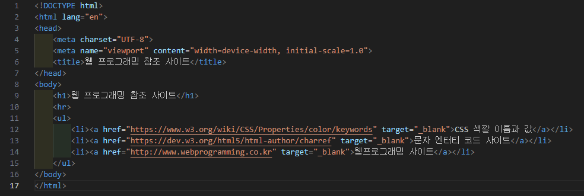
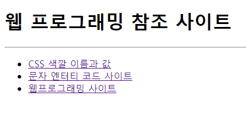

# 109페이지 실습문제 5번 문제

-----------------------------

## HTML 파일의 구성

-----------------------------

> 해당 문제에서는 다음과 같은 조건을 충족해야합니다.
+ 순서가 없는 리스트로 링크 연결
+ 링크로 열리는 페이지는 새 윈도우를 열어 출력

## 순서가 없는 리스트로 링크 연결

-----------------------------

> ul 태그를 사용하여 순서가 없는 리스트를 만들고 li 태그 안에 a 태그를 삽입하여 링크를 가지게끔 구현했습니다.

## 링크로 열리는 페이지는 새 윈도우를 열어 출력

-----------------------------

> a 태그의 target 속성을 _blank로 설정하여 링크로 열리는 페이지가 새 윈도우에서 출력되도록 구현했습니다.

## 완성된 웹페이지와 코드

-----------------------------

> 다음은 완성된 웹페이지 사진과 코드 사진입니다.

