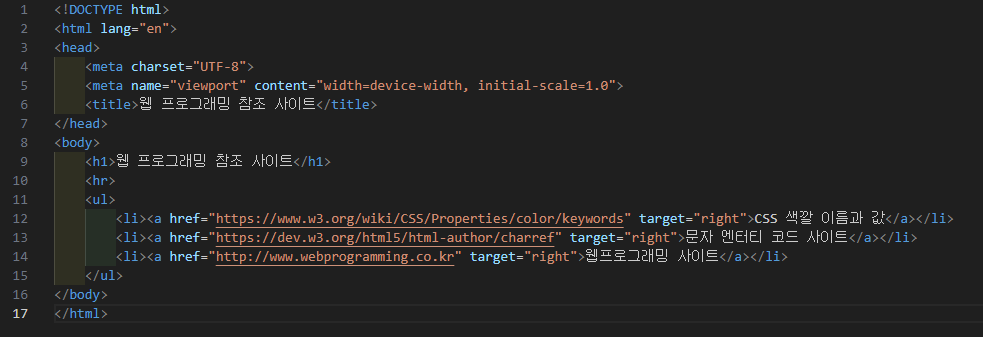
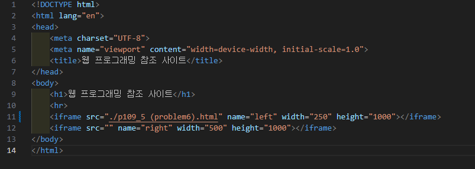
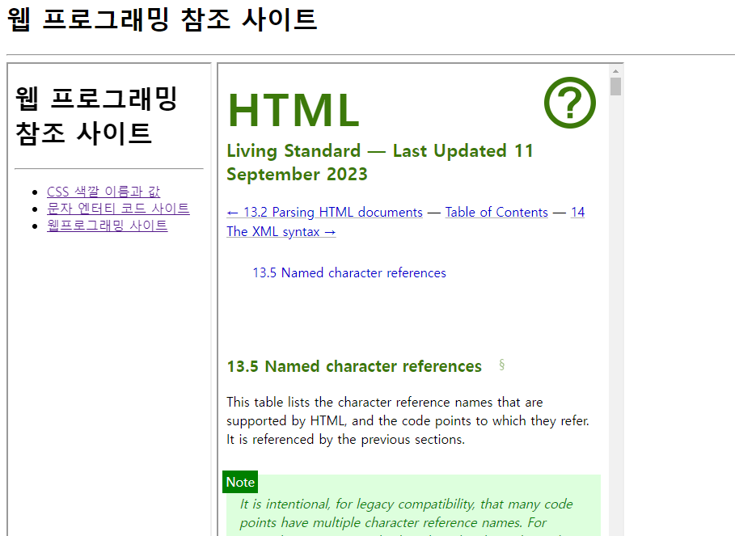

# 109페이지 실습문제 6번 문제

-----------------------------

## HTML 파일의 구성

-----------------------------

> 해당 문제에서는 다음과 같은 조건을 충족해야합니다.
+ 실습문제 5번을 활용하여 2개의 윈도우 출력
+ 왼쪽 윈도우에서 링크 클릭 시 오른쪽 윈도우에서 출력
+ 왼쪽 윈도우의 폭은 250픽셀, 오른쪽 윈도우의 폭은 500픽셀로 설정

## 실습문제 5번을 활용하여 2개의 윈도우 출력

-----------------------------

> iframe 태그에서 src 속성을 p109_5 (problem6).html로 연결하여 구현했습니다.

## 왼쪽 윈도우에서 링크 클릭 시 오른쪽 윈도우에서 출력

-----------------------------

> 오른쪽 윈도우의 name 속성을 right로 설정하고, p109_5 (problem6).html에서 target 속성을 right로 설정하여 구현했습니다.

## 왼쪽 윈도우의 폭은 250픽셀, 오른쪽 윈도우의 폭은 500픽셀로 설정

-----------------------------

> iframe 태그의 width 속성을 각각 250픽셀, 500픽셀로 설정하여 구현했습니다.

## 완성된 웹페이지와 코드

-----------------------------

> 다음은 완성된 웹페이지 사진과 코드 사진입니다.

