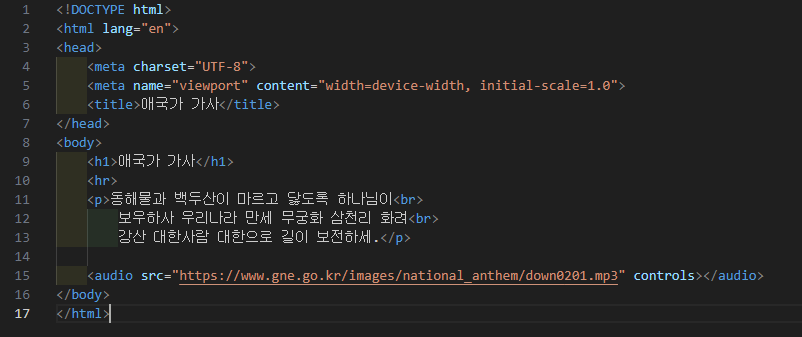
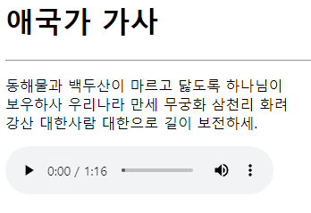

# 110페이지 실습문제 7번 문제

-----------------------------

## HTML 파일의 구성

-----------------------------

> 해당 문제에서는 다음과 같은 조건을 충족해야합니다.
+ mp3 파일의 재생
+ mp3 파일 컨트롤러

## mp3 파일의 재생

-----------------------------

> mp3 파일의 재생은 audio 태그의 src 속성을 mp3 파일이 있는 경로로 설정하여 구현했습니다.

## mp3 파일 컨트롤러

-----------------------------

> 재생 및 중지, 사운드 설정을 위한 컨트롤러는 audio 태그의 controls 속성을 통해 구현했습니다.

## 완성된 웹페이지와 코드

-----------------------------

> 다음은 완성된 웹페이지 사진과 코드 사진입니다.

