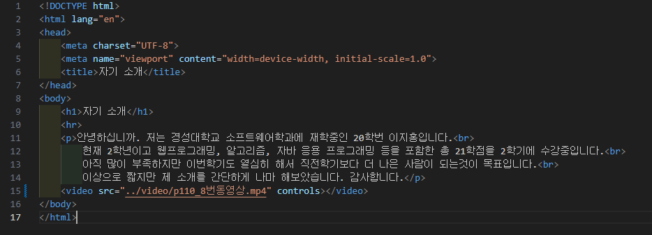
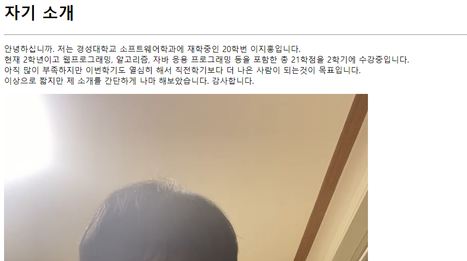

# 110페이지 실습문제 8번 문제

-----------------------------

## HTML 파일의 구성

-----------------------------

> 해당 문제에서는 다음과 같은 조건을 충족해야합니다.
+ 영상 출력
+ 영상 컨트롤러

## 영상 출력

-----------------------------

> 영상 출력은 video 태그에 src 속성을 사용하여 구현하였습니다.

## 영상 컨트롤러

-----------------------------

> 영상 컨트롤러는 audio 태그를 사용할 때와 똑같이 controls 속성을 사용하여 구현하였습니다.

## 완성된 웹페이지와 코드

-----------------------------

> 다음은 완성된 웹페이지 사진과 코드 사진입니다.

