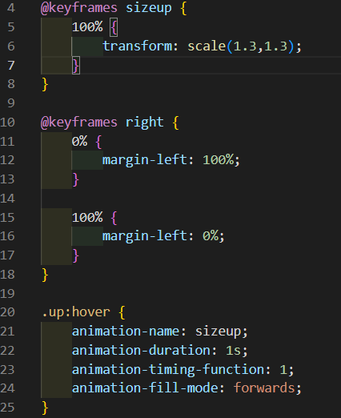
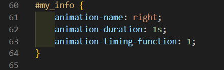

# 자기소개서 작성

-----------------------------

## 수정 사항

> 주어진 HTML, CSS 파일에서 내용을 제 자기소개 내역으로 수정하고, CSS에서 애니메이션을 추가하였습니다.

## CSS 애니메이션

-----------------------------

> 첫번째로, 웹페이지 접속 시, 페이지의 요소들이 오른쪽에서 왼쪽으로 슬라이드 되며 나오게 끔 구현했습니다.
> @keyframes 를 통해 right 라는 이동 로직을 만들고, 0% 일때 margin-left를 100%로 만들고 100% 일때 margin-left를 0%로 설정합니다.
> div 태그들의 스타일 속성에서 animation-name 을 right로 설정하고, animation-duration을 제일 위 요소는 1s 부터 아래로 올수록 0.5s씩 늘려서 순차적으로 슬라이드 되게끔 합니다. 그리고 animation-timing-function 을 1로 설정하여 부드럽게 진행될 수 있게끔 합니다.

> 두번째로, 기술 스택 요소에 마우스를 올리면 요소의 스케일이 커지게끔 구현했습니다.
> @keyframes 를 통해 sizeup 이라는 스케일 로직을 만들고 100% 일때, transform : scale(1.3, 1.3) 으로 설정하여, 요소의 x축과 y축이 1.3배 커지게끔 합니다.
> 기술 스택 요소들의 스타일 속성에서 animation-name을 sizeup 으로 설정하고, animation-duration 을 1s로 설정합니다. animation-timing-function을 1로 설정하여 똑같이 부드럽게 설정하고, animation-fill-mode를 forward로 설정하여 마우스를 올리고 있으면 애니메이션이 끝난 후의 상태를 유지하게 설정했습니다.

## CSS 코드의 일부

-----------------------------

> 애니메이션에 포함된 코드입니다.

