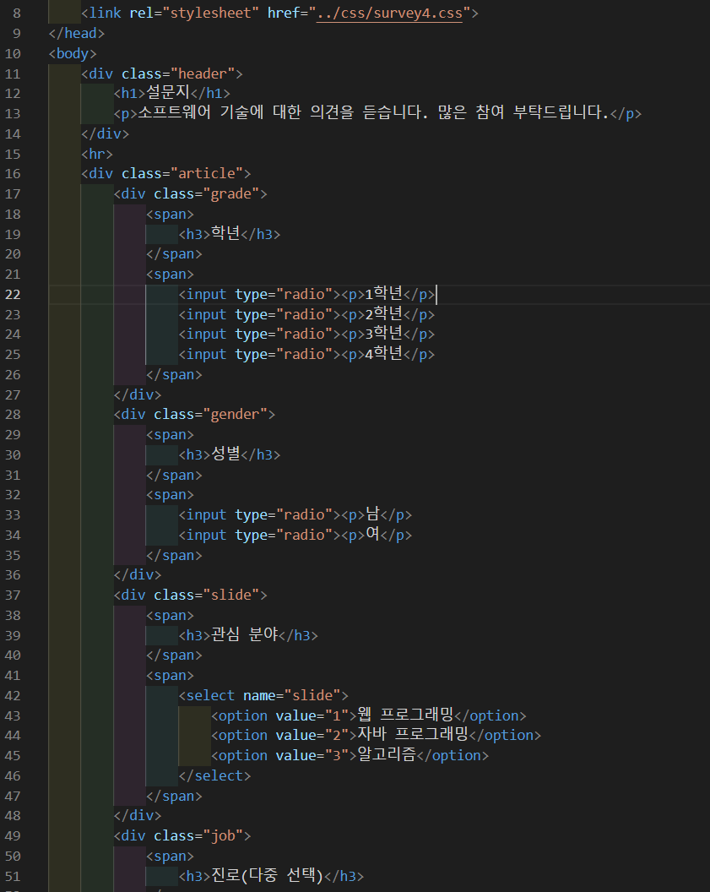
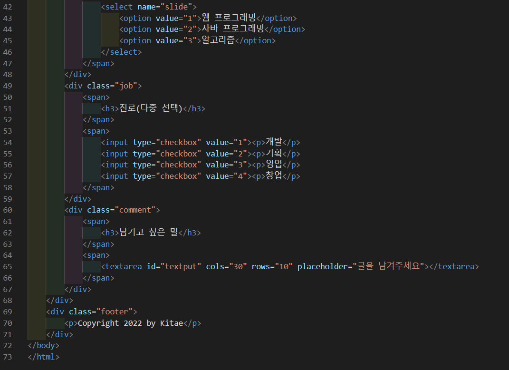
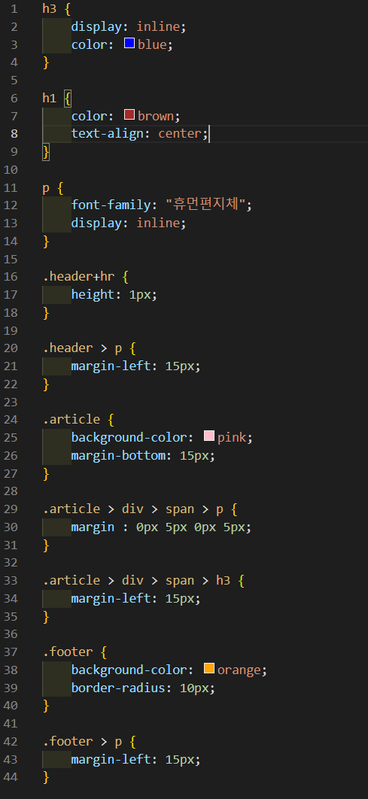
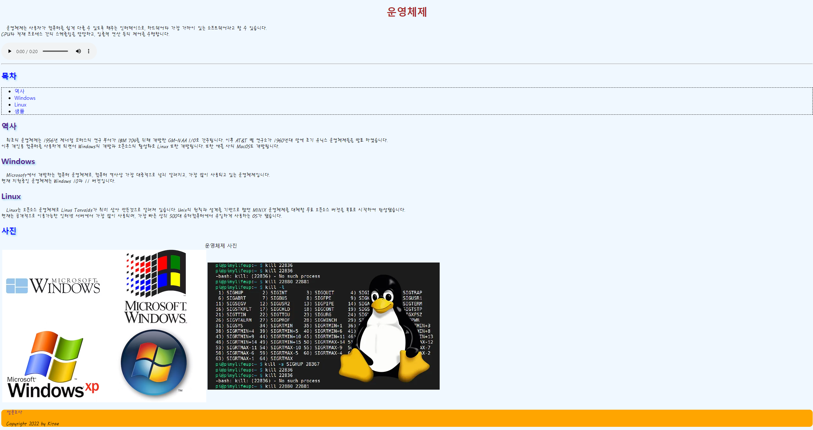
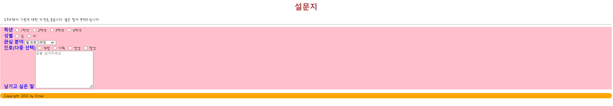
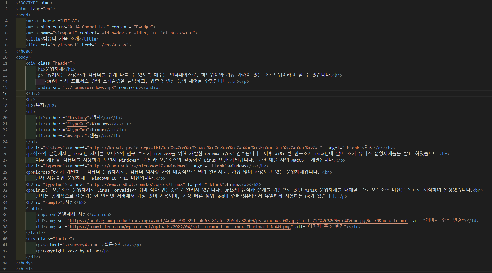
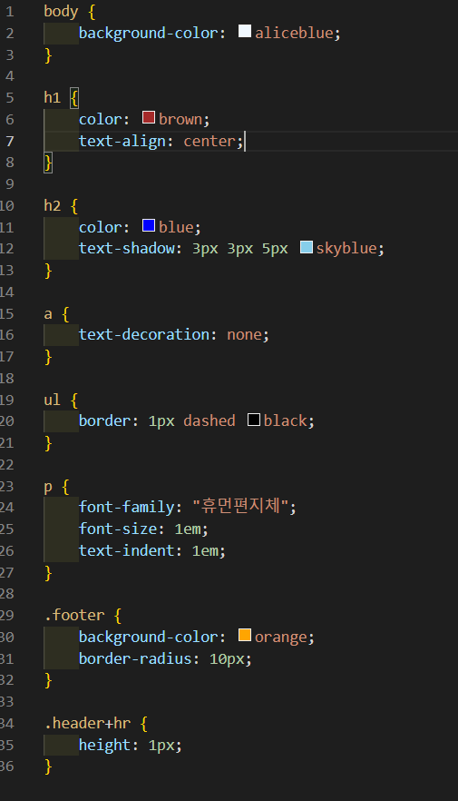

# 202페이지 OpenChallenge 04번 문제

-----------------------------

## 웹페이지의 구성

> 문제에서 제시한 조건은 다음과 같습니다.

+ h1 태그 스타일 적용
+ body 태그 스타일 적용
+ header 태그의 아래쪽만 1px 직선 테두리
+ ul 태그 스타일 적용
+ a 태그 스타일 적용
+ p 태그 스타일 적용
+ h2 태그 스타일 적용
+ footer 태그 스타일 적용
+ survey4.html 작성 및 4.html 파일과 연결

## h1 태그 스타일 적용

-----------------------------

> h1 태그에 brown의 글자색, 텍스트 정렬을 center로 하는 조건은 h1 태그의 스타일 속성에서 color 속성을 brown 으로 설정하고, text-align 속성을 center 로 설정하여 해결했습니다.

## body 태그 스타일 적용

-----------------------------

> body 태그의 배경색을 aliceblue 로 설정하는 조건은 body 태그의 스타일 속성에서 background-color 속성을 aliceblue 로 설정하여 해결했습니다.

## header 태그의 아래쪽만 1px 직선 테두리

-----------------------------

> header 태그 아래쪽에 있는 1px 직선 테두리는 header 태그 바로 다음에 hr 태그를 생성한 후, css 파일에서 .header+hr 의 스타일 속성에서 height 속성을 1px 로 설정하여 해결했습니다.
> 이 과정에서 인접 형태 선택자를 사용해야 header 태그의 아래쪽 테두리만 1px로 설정가능 합니다.

## ul 태그 스타일 적용

-----------------------------

> ul 태그에 1px의 점선 테두리를 설정하는 조건은 ul 태그의 스타일 속성에서 border 속성을 1px dashed black 으로 설정하여 해결했습니다.
> 위 속성에서 dashed는 점선을 의미합니다.

## a 태그 스타일 적용

-----------------------------

> a 태그의 링크 밑줄을 없애는 조건은 스타일 속성에서 text-decoration 속성을 none으로 설정하여 해결했습니다.

## p 태그 스타일 적용

-----------------------------

> p 태그의 폰트를 휴먼 편지체, 글자 크기 1em, 들여쓰기 1em을 설정하는 조건은 p 태그의 스타일 속성에서 font-family 속성을 "휴먼편지체" 로 설정하였고, font-size 속성을 1em으로 설정한 후, text-indent 속성을 1em으로 설정하여 해결했습니다.

## h2 태그 스타일 적용

-----------------------------

> h2 태그에 blue 글자색과 text-shadow 꾸밈 조건은 h2 태그의 스타일 속성에서 color 속성을 blue로 설정하고, text-shadow 속성을 3px 3px 5px skyblue 로 설정하여 해결했습니다.

## footer 태그 스타일 적용

-----------------------------

> footer 태그에 orange 배경과 둥근 모서리 테두리를 설정하는 조건은 footer 태그의 스타일 속성에서 background-color 속성을 orange로 설정하고, border-radius 속성을 10px로 설정하여 해결했습니다.

## survey4.html 작성 및 4.html 파일과 연결

-----------------------------

> 4.html 파일에서 작성한 footer 태그 안에 있는 a 태그의 링크를 survey4.html 로 연결하고 survey4.html을 작성했습니다.
> 교재에 포함된 survey4.html 예제 사진과 최대한 동일하게 제작하였습니다.

## 완성된 웹페이지 및 코드

-----------------------------

> 다음은 완성된 웹페이지 사진과 코드 사진입니다.

