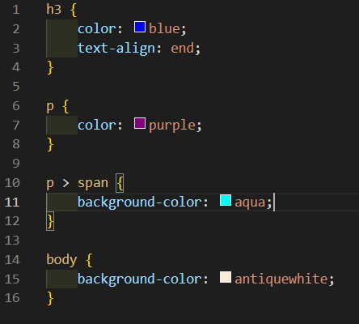

# 207페이지 실습문제 1번 문제

-----------------------------

## 웹페이지의 구성

> 문제에서 요구한 웹페이지는 다음 조건을 만족해야 합니다.

+ h3 태그는 웹페이지 오른쪽 끝에 설정 및 글자 색상 설정
+ p 태그에 글자 색상 설정
+ span 태그에 배경색 설정

## h3 태그 웹페이지 오른쪽 끝 설정 및 글자 색상 설정

-----------------------------

> h3 태그를 웹페이지 오른쪽 끝에 설정하는 조건은 h3 태그의 스타일 속성에서 text-align 속성을 end로 설정합니다.
> 글자 색상은 color 속성을 blue 로 설정하였습니다.

## p 태그에 글자 색상 설정

-----------------------------

> p 태그에 글자 색상 설정은 p 태그의 스타일 속성에서 color 속성을 purple로 설정하였습니다.

## span 태그에 배경색 설정

-----------------------------

> 해당 조건은 p 태그의 안에 있는 span에 적용 되는 속성이므로, p > span 의 스타일 속성에서 background-color를 aqua로 설정하였습니다.
> 자식 셀렉터를 사용하지 않으면, 모든 span에 적용되므로, 위 처럼 설정했습니다.

## 완성된 웹페이지 및 코드

-----------------------------

> 다음은 완성된 웹페이지 사진 및 코드 사진입니다.

