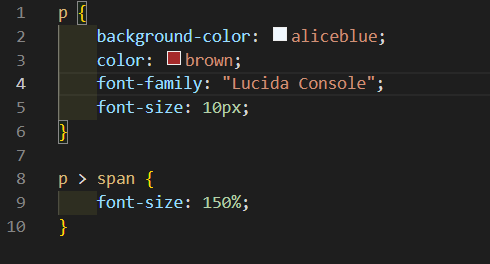
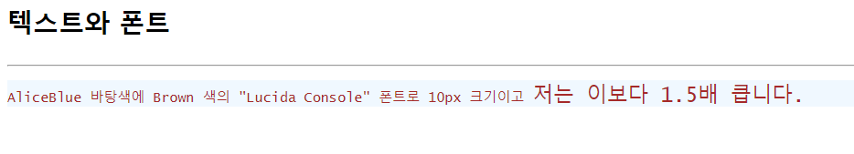

# 207페이지 실습문제 2번 문제

-----------------------------

## 웹페이지의 구성

> 문제에서 요구한 페이지는 다음 조건을 만족해야합니다.

+ p 태그의 배경색 설정, 글꼴, 글자 색상, 글자 크기 설정
+ span 태그의 글자 크기 설정

## p 태그의 배경색, 글꼴, 글자 색상, 글자 크기 설정

-----------------------------

> p 태그의 스타일 설정은 p 태그의 스타일 속성에서 background-color 를 aliceblue 로 설정하였고, font-family 속성을 "Lucida Console", color 속성에 brown, font-size에 10px을 설정하여 구현하였습니다.

## span 태그의 글자 크기 설정

-----------------------------

> p 태그 안에 있는 span 태그의 글자 크기 설정이므로, p > span 의 스타일 속성에서 font-size를 150%로 설정하였습니다.

## 완성된 웹페이지와 코드

-----------------------------

> 다음은 완성된 웹페이지 사진과 코드 사진입니다.

