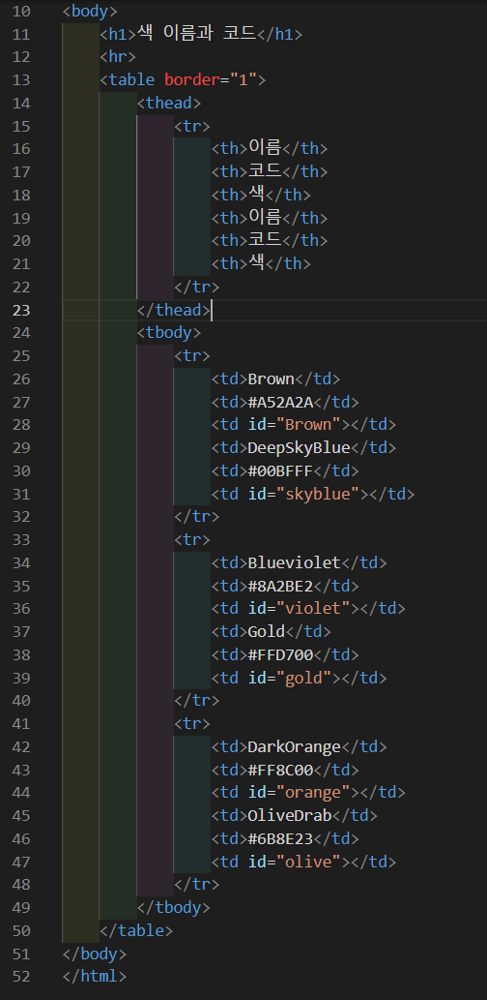
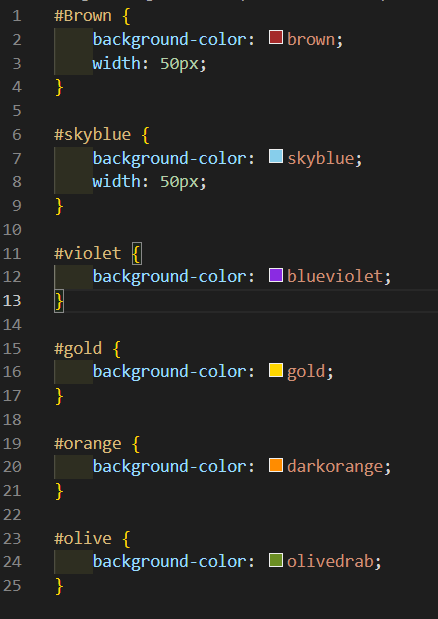
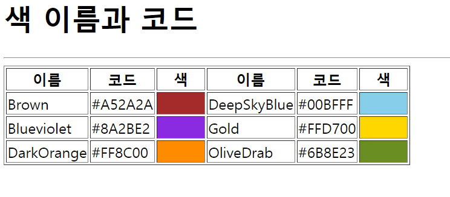

# 207페이지 실습문제 3번 문제

-----------------------------

## 웹페이지의 구성

-----------------------------

> 문제에서 요구한 웹페이지는 다음 조건을 만족해야합니다.

+ 색 이름, 색 코드, 색을 보여주는 테이블 작성

## 테이블 작성

-----------------------------

> 문제에서 예시로 보여준 페이지를 제작하기 위해 table 태그로 테이블을 생성합니다. 이때, border 속성을 1로 설정합니다.
> 제목으로 이름, 코드, 색 이 2쌍 존재하기 때문에 thead > tr > th*6 으로 행을 생성하고 값을 작성합니다.
> 본문에 열에 해당하는 값을 넣기 위해 tbody > tr*3 > td*6 으로 행렬을 생성하고 값을 작성합니다.
> 각 색상을 넣어야하는 칸은 id 값을 부여하고 스타일 속성의 background-color 속성을 색상에 맞게 설정해줍니다.
> 예제 사진과 비슷하게 출력하기 위해 테이블의 제일 위에 작성되는 색상은 width 속성을 변경하여 사이즈를 조절했습니다.

## 완성된 웹페이지와 코드

-----------------------------

> 다음은 완성된 웹페이지 사진과 코드 사진입니다.

