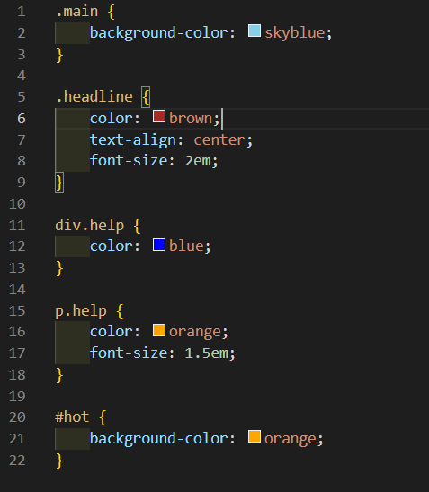
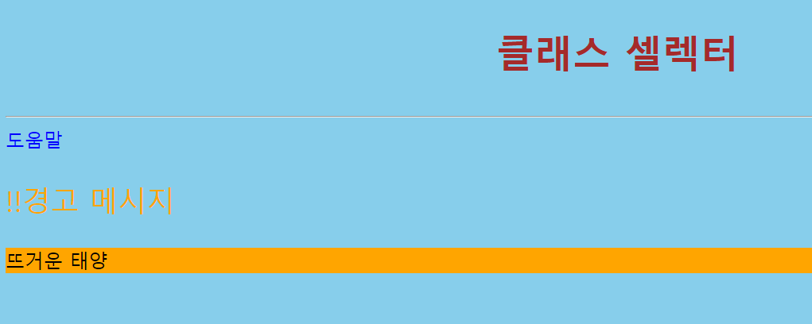

# 208페이지 실습문제 4번 문제

-----------------------------

## 웹페이지의 구성

> 문제에서 요구한 웹페이지는 다음과 같은 조건을 만족해야합니다.

+ 클래스, ID 요구사항 스타일 적용

## 클래스, ID 요구사항 적용

-----------------------------

> 문제에서 HTML 파일을 수정하지 않고 스타일 시트와 셀렉터를 이용하여 예제처럼 출력을 요구하였으므로, 클래스 셀렉터를 사용하여 스타일시트를 작성했습니다.
> main 클래스의 background-color 를 skyblue로 설정했습니다.
> headline 클래스의 color를 brown으로 설정하고 text-align 속성을 center로 설정했습니다. 예제가 문자 크기를 비슷하게 하기위해 font-size를 2em으로 설정했습니다.
> div 태그의 help 클래스를 설정하기 위해 div.help 로 작성하여 color를 blue로 설정했습니다.
> p 태그의 help 클래스를 설정하기 위해 p.help 로 작성하여 color를 orange로 설정하고, font-size를 1.5em 으로 설정했습니다.
> hot id를 가지는 태그를 설정하기 위해 #hot 으로 작성하여 background-color 를 orange로 설정했습니다.

## 완성된 웹페이지와 코드

-----------------------------

> 다음은 완성된 웹페이지 사진과 코드 사진입니다.

