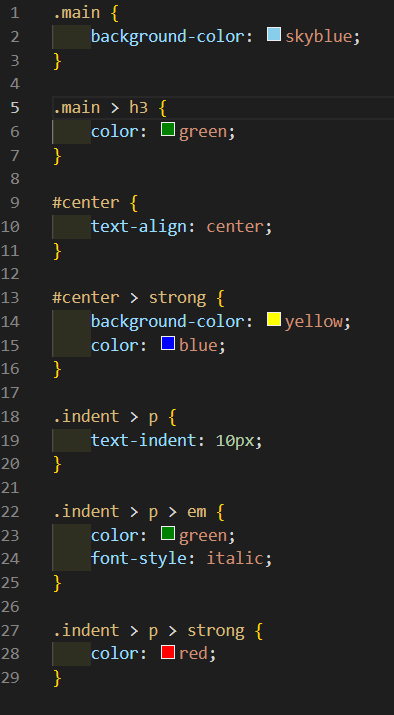
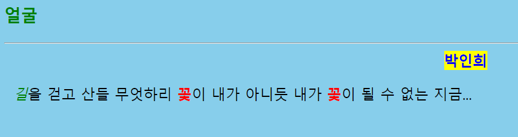

# 208페이지 실습문제 5번 문제

-----------------------------

## 웹페이지의 구성

> 문제에서 요구한 웹페이지는 다음 조건을 만족해야합니다.

+ 클래스, ID, 태그 요구사항 스타일 적용

## 클래스, ID, 태그 요구사항 스타일 적용

-----------------------------

> 4번 문제와 같이 HTML 파일을 수정하지 않고 스타일 시트를 작성해야하므로, 클래스, ID, 태그를 사용하여 수정합니다.
> main 클래스의 background-color 속성을 skyblue 로 설정했습니다.
> main 클래스의 자식 태그인 h3의 color 속성을 green 으로 설정했습니다.
> center id를 가진 태그의 text-align 속성을 center로 설정했습니다.
> center id를 가진 태그의 자식 태그 중 strong 태그의 background-color 속성을 yellow 로 설정하고, color는 blue 로 설정했습니다.
> indent id를 가진 태그의 자식 태그 중 p 태그의 text-indent 속성을 10px 로 설정했습니다.
> indent id를 가진 태그의 자식 태그 중 p 태그의 자식으로 있는 em 태그의 color 속성을 green 으로 설정하고 font-style을 italic 으로 설정했습니다.
> indent id를 가진 태그의 자식 태그 중 p 태그의 자식으로 있는 strong 태그의 color 속성을 red 로 설정했습니다.

## 완성된 웹페이지와 코드

-----------------------------

> 다음은 완성된 웹페이지 사진과 코드 사진입니다.

