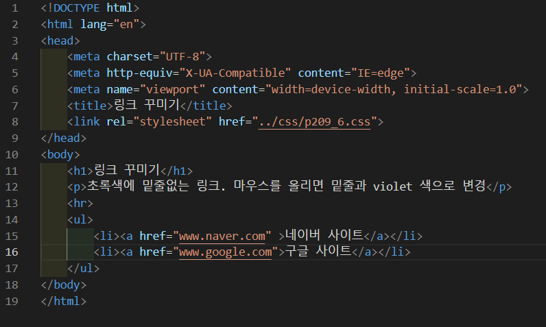
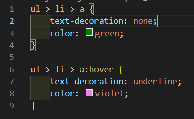
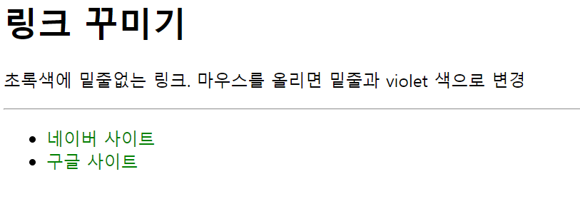
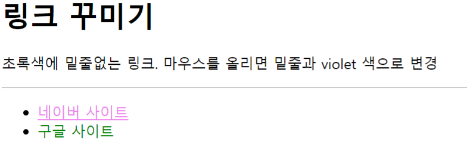

# 209페이지 실습문제 6번 문제

-----------------------------

## 웹페이지의 구성

> 문제에서 요구한 웹페이지는 다음 조건을 만족해야 합니다.

+ 초록색의 밑줄 없는 링크 생성
+ 마우스가 올라가면 밑줄 생성 및 색상을 violet 으로 변경

## 초록색의 밑줄 없는 링크 생성

-----------------------------

> 리스트 안의 목록으로 있는 링크들의 밑줄을 없애고 색상을 초록색으로 변경해야 하므로, ul > li > a 의 스타일 속성에서 text-decoration 속성을 none으로 설정하고, color를 green으로 설정했습니다.

## 마우스가 올라가면 밑줄 생성 및 색상 변경

-----------------------------

> 해당 링크들에 마우스가 올라갔을 때만 해당 조건이 실행되므로, ul > li > a:hover 의 스타일 속성에서 text-decoration 속성을 underline 으로 설정하고, color를 violet으로 설정했습니다.

## 완성된 웹페이지와 코드

-----------------------------

> 다음은 완성된 웹페이지 사진과 코드 사진입니다.

