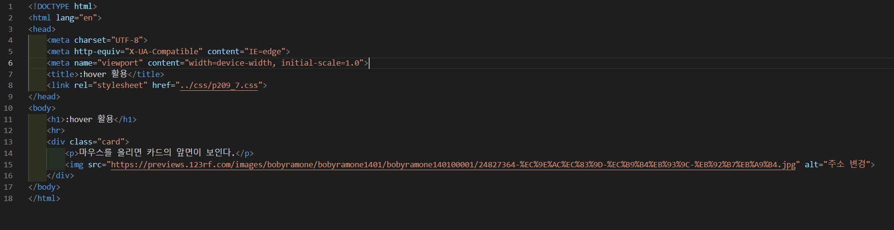
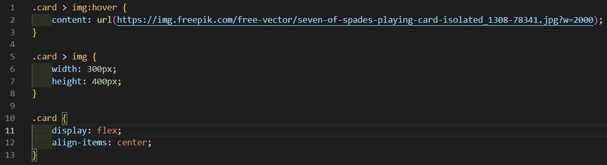
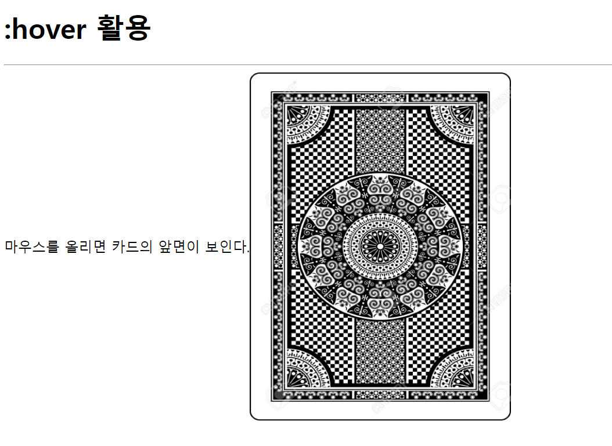
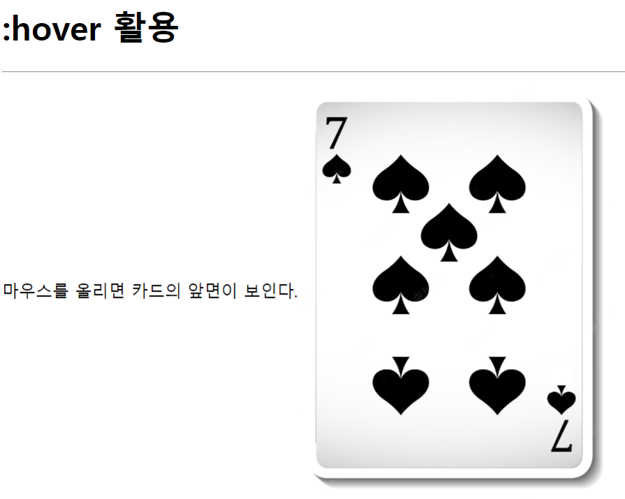

# 209페이지 실습문제 7번 문제

-----------------------------

## 웹페이지의 구성

> 문제에서 요구한 웹페이지는 다음과 같은 조건을 만족해야 합니다.

+ div 태그를 이용하여 카드의 뒷면 출력
+ 카드에 마우스를 올리면 카드의 앞면이 보이게 작성

## div 태그를 이용하여 카드의 뒷면 출력

-----------------------------

> div 태그 안에 img 태그를 작성하여 카드의 뒷면을 출력하게 했습니다.
> 내용과 이미지가 예제와 비슷하게 나오게끔 하기 위해 img 의 width, height 값을 수정하였고, div 태그의 display 속성을 flex로 설정하고, align-items 속성을 center로 하였습니다.

## 카드에 마우스를 올리면 카드의 앞면이 보이게 작성

-----------------------------

> div 태그의 클래스인 .card 아래의 img의 이미지 주소를 변경하여 카드의 앞면이 나오게끔 작성했습니다.
> 따라서 작성을 .card > img:hover 를 통해 content 속성을 변경하여 이미지가 바뀌게합니다.

## 완성된 웹페이지와 코드

-----------------------------

> 다음은 완성된 웹페이지 사진과 코드 사진입니다.

