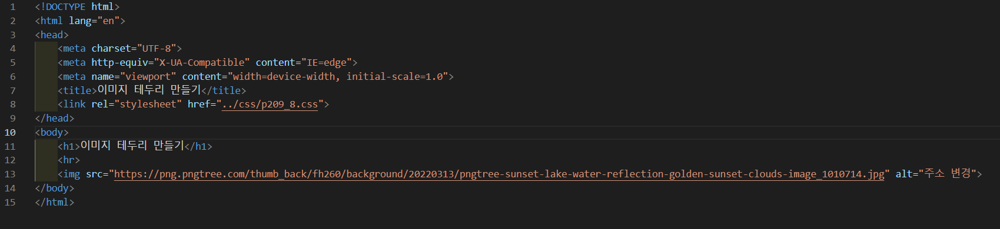
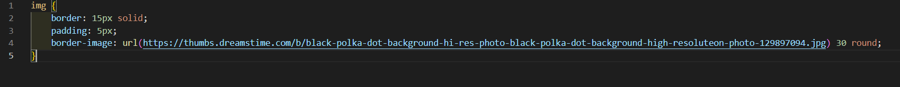
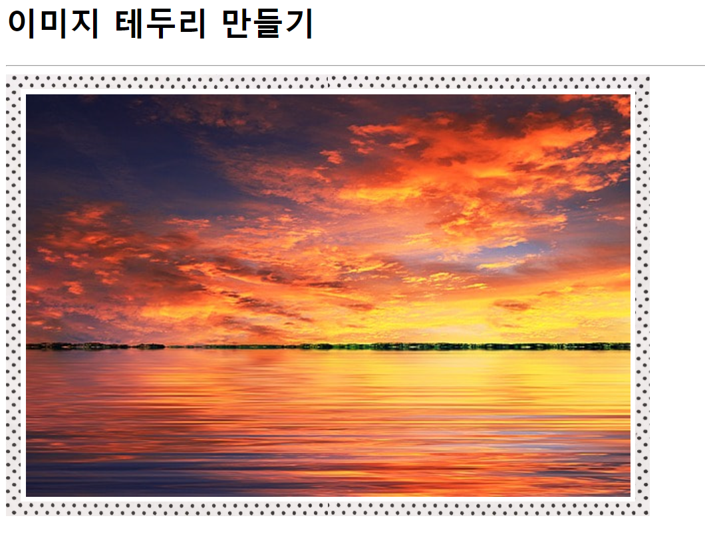

# 209페이지 실습문제 8번 문제

-----------------------------

## 웹페이지의 구성

> 문제에서 요구한 웹페이지는 다음 조건을 만족해야 합니다.

+ 액자 모양의 이미지 테두리 생성
+ 테두리의 두께, 패딩 설정

## 액자 모양의 이미지 테두리 생성

-----------------------------

> 액자 모양의 이미지 테두리를 만들기 위해 img 태그의 스타일 속성에서 border-image를 url을 걸어 설정해주고 30 round로 끊기지 않게끔 설정합니다.

## 테두리의 두께, 패딩 설정

-----------------------------

> 테두리의 두께를 설정하기 위해 img 태그의 스타일 속성에서 border를 15px로 설정하고, padding을 5px로 설정했습니다.

## 완성된 웹페이지와 코드

-----------------------------

> 다음은 완성된 웹페이지 사진과 코드 사진입니다.

