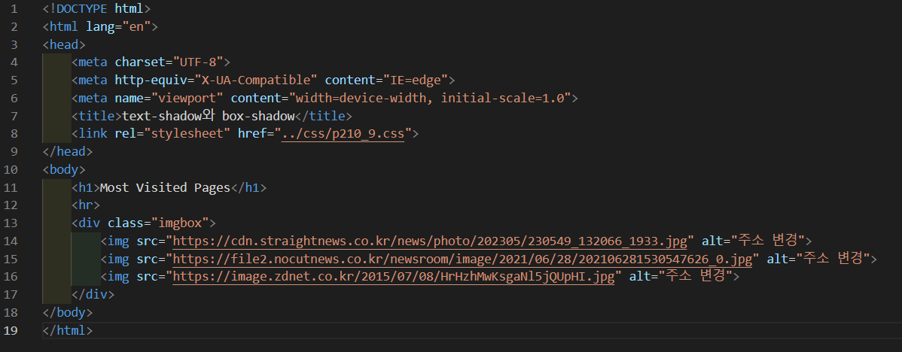
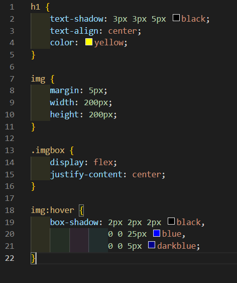
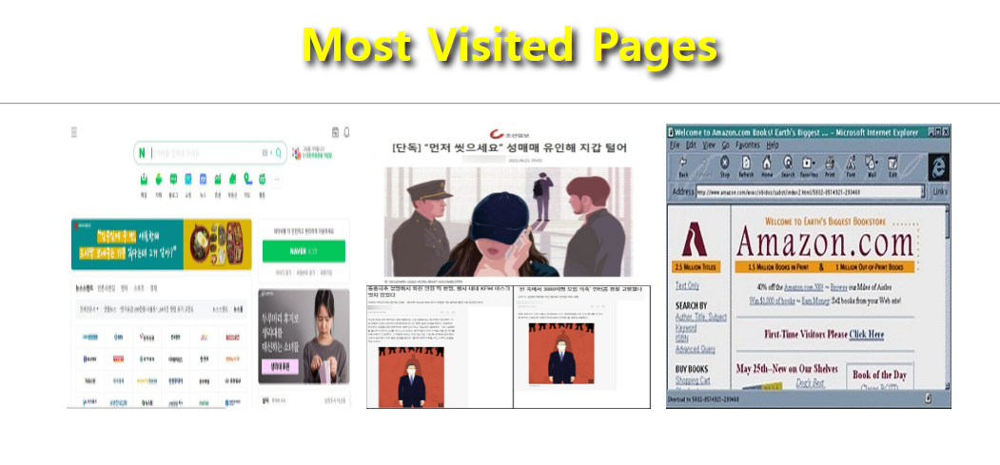
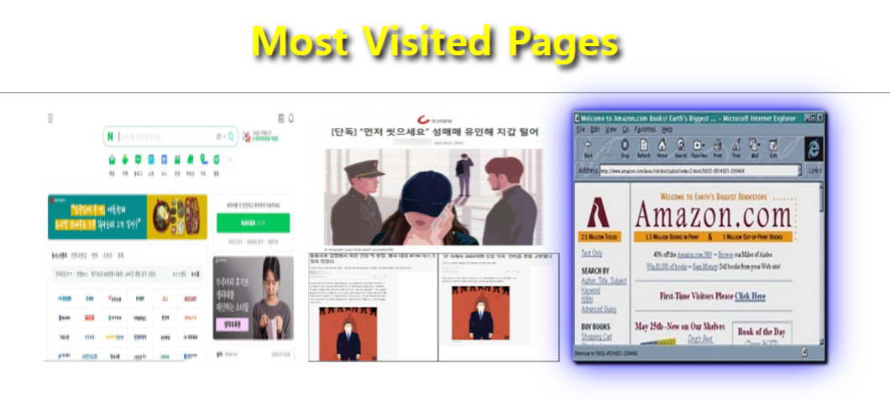

# 210페이지 실습문제 9번 문제

-----------------------------

## 웹페이지의 구성

> 문제에서 요구한 웹페이지는 다음 조건을 만족해야합니다.

+ Most Visited Pages 텍스트를 text-shadow로 꾸미기
+ 이미지에 마우스를 올리면 box-shadow로 그림자 생성

## Most Visited Pages 텍스트를 text-shadow로 꾸미기

-----------------------------

> 해당 텍스트를 h1 태그로 작성한 후, h1 태그의 스타일 속성에서 text-shadow를 3px 3px 5px black으로 설정하여 그림자를 생성한 후, text-align 속성을 center로 설정하였습니다.

## 이미지에 마우스를 올리면 box-shadow로 그림자 생성

-----------------------------

> 마우스를 올릴때 그림자가 생겨야 하므로, img:hover 에서 box-shadow를 2px 2px 2px black, 0 0 25px blue, 0 0 5px darkblue 로 설정하여 예제와 비슷하게 구현했습니다.

## 완성된 웹페이지와 코드

-----------------------------

> 다음은 완성된 웹페이지 사진과 코드 사진입니다.

