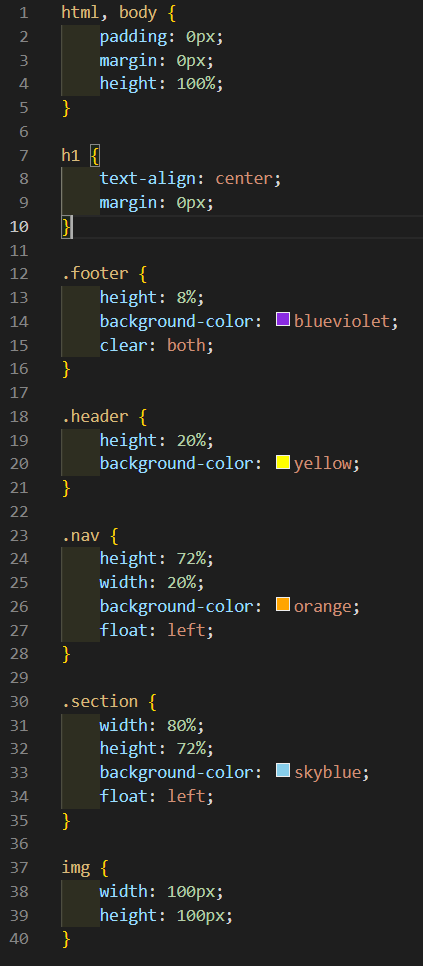

# 249페이지 OpenChallenge 05번 문제

-----------------------------

## 웹페이지의 구성

> 문제에서 제시한 조건은 다음과 같습니다.

+ 4.html 파일에서 header, nav, section, footer 영역을 적절히 배치하여 예제처럼 출력
+ survey4.html 파일 또한 적절히 배치

## header, nav, section, footer 영역을 적절히 배치

-----------------------------

> header 부분은 제일 윗부분이므로, 주어진 height값 대로 설정한 후, background-color를 yellow로 설정했습니다.
> nav 부분은 왼쪽에 붙어야할 부분으로, float 속성을 left로 하여 왼쪽에 붙게한 후, section이 출력될 공간을 위해 width를 20%로 설정했습니다.
> section 부분 또한 nav 바로 옆에 붙어야하므로, float 속성을 left로 설정한 후, width 를 80%로 설정했습니다.
> footer 부분은 nav와 section의 float 속성에 의해 위로 말려가므로, clear 속성을 both로 설정하여 밑으로 내려오게끔 설정했습니다.

## survey4.html 배치

-----------------------------

> survey4.html은 문제에서 주어진 사진과 최대한 비슷하게 구현했습니다.

## 완성된 웹페이지와 코드

-----------------------------

> 다음은 완성된 웹페이지 사진과 코드 사진입니다.

