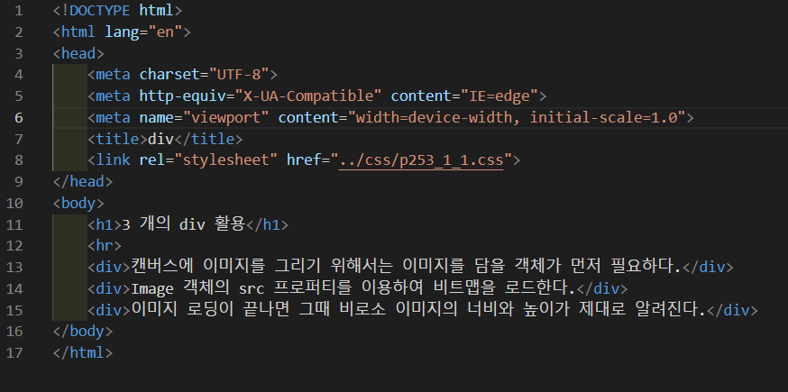
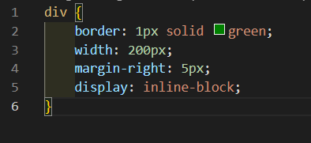
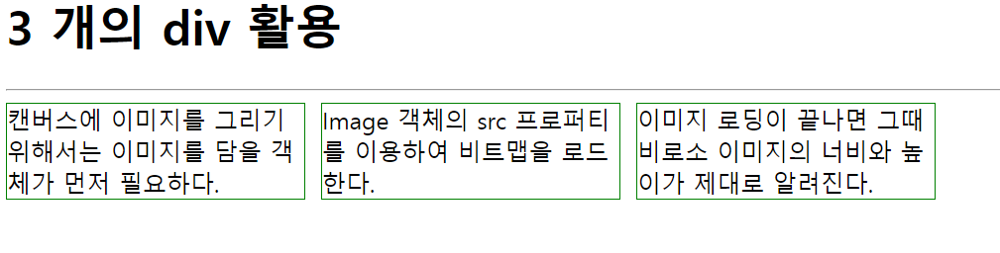
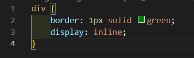
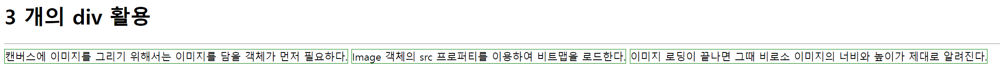

# 253페이지 실습문제 1번 문제

-----------------------------

## 1-1번 문제

-----------------------------

### 웹페이지의 구성

> 문제에서 요구한 웹페이지는 다음 조건을 만족하여야 합니다.

+ display 속성을 사용하여 3개의 div 태그에 담긴 텍스트가 예제처럼 출력될것

### display 속성을 사용하여 예제처럼 구성

-----------------------------

> 예제처럼 구현하기 위해 div 태그의 스타일 속성에서 border를 1px solid green 으로 설정하고, width를 200px로 설정한 후, display 속성을 inline-block 으로 설정하여 인라인 형식이지만, 사이즈 조절이 가능하게 만듭니다. 그리고 margin-right를 5px을 설정하여 예제와 비슷하게 구현했습니다.

### 완성된 웹페이지와 코드

-----------------------------

> 다음은 완성된 웹페이지 사진과 코드 사진입니다.

## 1-2번 문제

-----------------------------

### 웹페이지의 구성

> 문제에서 요구한 웹페이지는 다음 조건을 만족하여야 합니다.

+ display 속성을 사용하여 예제처럼 출력될것

### display 속성을 사용하여 예제처럼 구성

-----------------------------

> div 블록이 이어져서 출력되게끔 하기 위해 display 속성을 inline으로 설정합니다. 그리고 border를 1px solid green 으로 설정하여 테두리를 만듭니다.

### 완성된 웹페이지와 코드

-----------------------------

> 다음은 완성된 웹페이지 사진과 코드 사진입니다.

