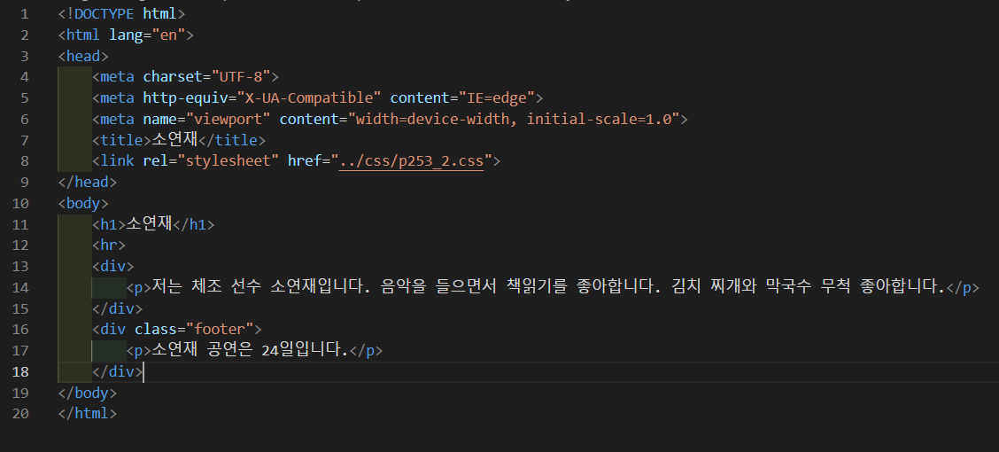
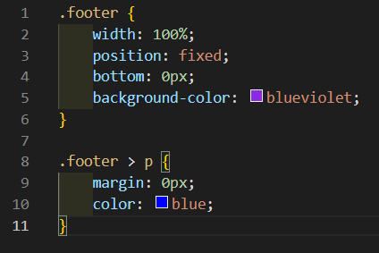
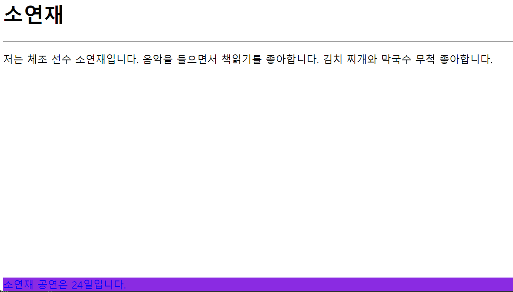

# 253페이지 실습문제 2번 문제

-----------------------------

## 웹페이지의 구성

> 문제에서 요구한 웹페이지는 다음 조건을 만족해야 합니다.

+ position:fixed를 활용하여 광고문을 아래에 붙이고 브라우저 폭의 100%를 채울것

## 광고문 스타일 설정

-----------------------------

> 조건에서 주어진 대로 하기 위해, footer의 스타일 속성에서 position을 fixed로 설정하고, bottom 속성을 0px로 하여 바닥에 붙입니다. 그리고 width 속성을 100%로 하여 브라우저를 꽉 채우게 설정하고, background-color를 blueviolet으로 설정합니다.

## 완성된 웹페이지와 코드

-----------------------------

> 다음은 완성된 웹페이지 사진과 코드 사진입니다.

