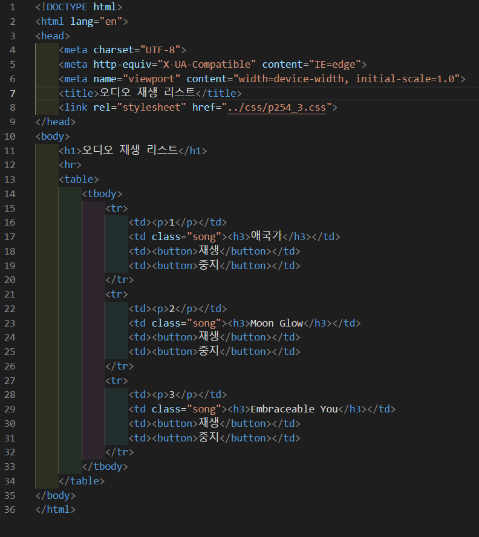
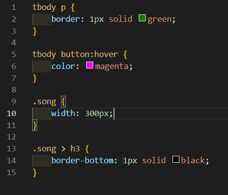
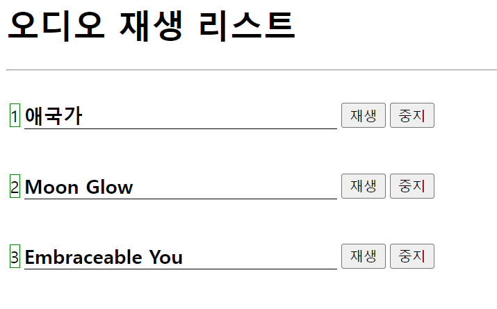
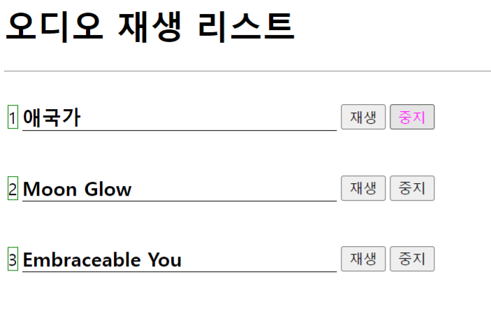

# 254페이지 실습문제 3번 문제

-----------------------------

## 웹페이지의 구성

> 문제에서 요구하는 웹페이지는 다음 조건을 만족해야합니다.

+ 오디오 재생 표를 작성
+ 버튼에 마우스를 올리면 색 변경

## 오디오 재생 표 작성

-----------------------------

> 오디오 재생 표를 작성하기 위해 table을 만들고, tbody>tr*3>*td*4 를 통해 기본적인 틀을 짜고 요소들을 채워 넣어줍니다.
> 숫자가 들어가는 부분은 p태그로 작성됐기 때문에, tbody의 자손 태그 p 태그의 스타일 속성에서 border 속성을 1px solid green 으로 설정했습니다.
> 예제 사진과 비슷하게 출력하기 위해, song 클래스를 가진 요소의 width 값을 300px로 설정하고, song 클래스의 자식 태그 중 h3 태그의 스타일 속성에서 border-bottom 속성을 1px solid black으로 설정합니다.

## 버튼에 마우스를 올리면 색 변경

-----------------------------

> 버튼에 마우스를 올릴 때 이벤트가 발생하므로, tbody button:hover 에서 color 속성을 magenta 로 변경합니다.

## 완성된 웹페이지와 코드

-----------------------------

> 다음은 완성된 웹페이지 사진과 코드 사진입니다.

