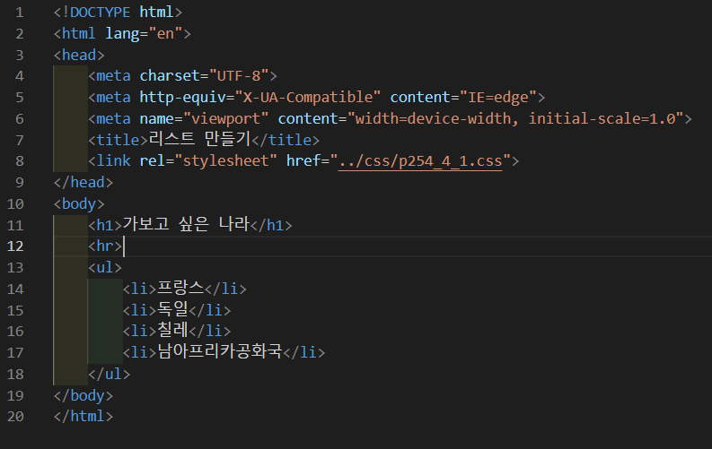
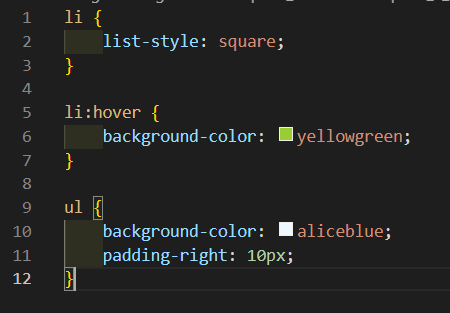
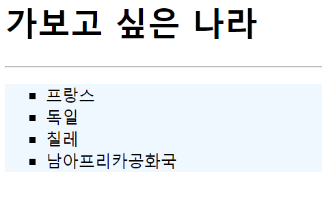
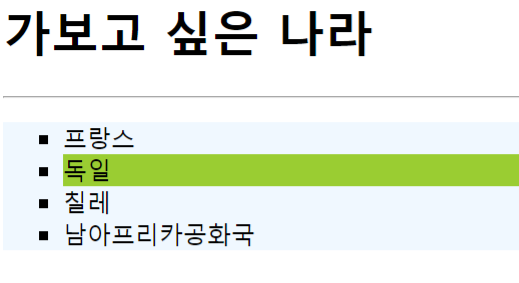
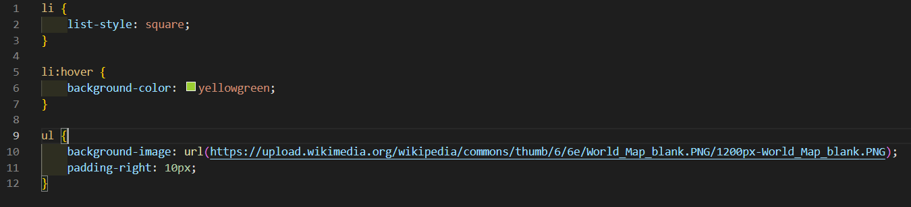
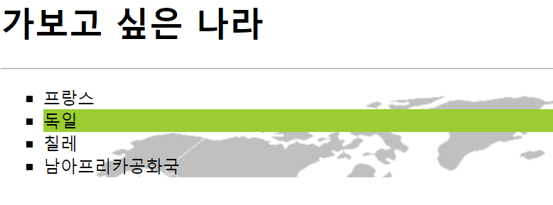

# 254페이지 실습문제 4번 문제

-----------------------------

## 4-1번 문제

-----------------------------

### 웹페이지의 구성

> 문제에서 요구한 웹페이지는 다음 조건을 만족해야 합니다.

+ 순서가 없는 리스트를 만들고, 리스트 아이템에 마우스를 올리면 배경색이 yellowgreen으로 바뀌어야함

### 순서가 없는 리스트를 만들고, 리스트 아이템에 마우스를 올리면 이벤트 발생

-----------------------------

> 순서가 없는 리스트를 구현해야 하므로, ul>li*4 를 통해 리스트를 만들고 내용을 작성합니다.
> 예제처럼 출력되게끔 하기 위해, ul의 스타일 속성에서 background-color를 aliceblue 로 설정하고, padding-right를 10px로 설정합니다. 그리고, li 스타일 속성에서 list-style 을 square로 설정하여 네모난 리스트 스타일을 구현합니다.
> 마우스를 올릴때 해당 리스트 아이템의 배경색이 변경되어야 하므로, li:hover 에서 background-color를 yellowgreen 으로 설정합니다.

### 완성된 웹페이지와 코드

-----------------------------

> 다음은 완성된 웹페이지 사진과 코드 사진입니다.

## 4-2번 문제

-----------------------------

### 웹페이지의 구성

> 문제에서 요구한 웹페이지는 다음 조건을 만족해야 합니다.

+ 4-1번 문제에서 리스트 배경을 이미지로 출력

### 리스트 배경을 이미지로 출력

-----------------------------

> 리스트의 배경을 이미지로 출력하기 위해 ul 태그의 스타일 속성에서 background-image 속성을 url을 통해 이미지 주소로 설정합니다.

### 완성된 웹페이지와 코드

-----------------------------

> 다음은 완성된 웹페이지 사진과 코드 사진입니다.

