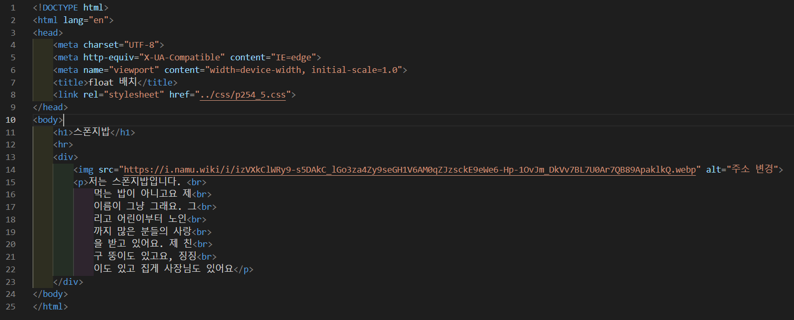
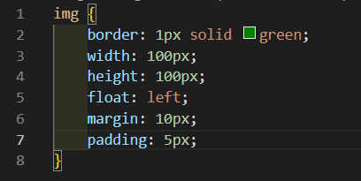
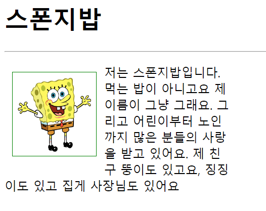

# 254페이지 실습문제 5번 문제

-----------------------------

## 웹페이지의 구성

> 문제에서 요구하는 웹페이지는 다음 조건을 만족해야 합니다.

+ 이미지가 왼쪽 모서리에서 10px 떨어진 위치에 나오도록 함
+ 이미지에 테두리를 두르고 여백 및 패딩 설정

## 이미지 출력 설정

-----------------------------

> 조건처럼 이미지를 출력하기 위해, img 태그의 스타일 속성에서 float 속성을 left로 설정하여 왼쪽으로 붙입니다.

## 테두리, 여백, 패딩 설정

-----------------------------

> 이미지의 테두리를 설정하기 위해 border 속성에서 1px solid green으로 설정하고, margin은 10px, padding은 5px로 설정합니다.
> 이렇게 설정함에 따라서, 이미지는 모서리로부터 10px 떨어지게 됩니다.

## 완성된 웹페이지와 코드

-----------------------------

> 다음은 완성된 웹페이지 사진과 코드 사진입니다.

