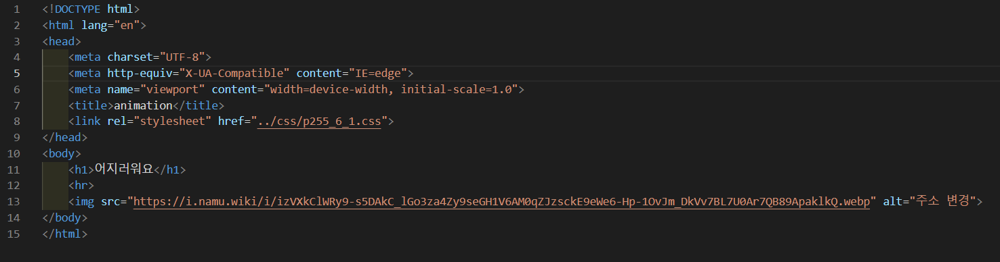
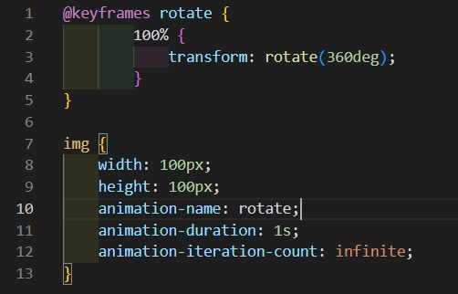
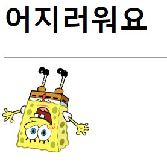
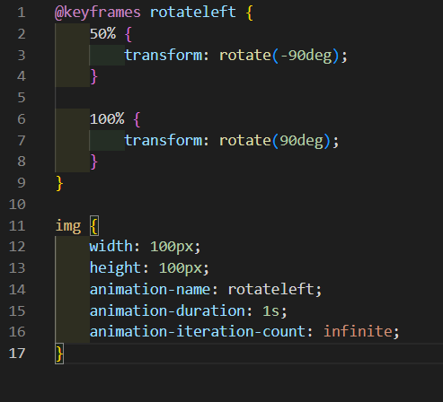
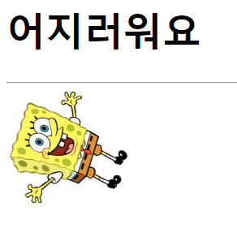

# 255페이지 실습문제 6번 문제

-----------------------------

## 6-1번 문제

-----------------------------

### 웹페이지의 구성

> 문제에서 요구하는 웹페이지는 다음 조건을 만족해야 합니다.

+ 1초에 한 바퀴씩 무한히 반복하는 애니메이션 구현

### 1초에 한 바퀴씩 무한히 반복하는 애니메이션 구현

-----------------------------

> 먼저 회전하는 애니메이션 구현을 위해 @keyframe 을 통해 rotate 라는 회전 로직을 작성합니다. 100%가 됐을 때, transform : rotate(360deg) 로 설정합니다. 즉, 100% 시간이 지나면 회전하여 원래 자리로 오게 설정합니다.
> 그다음 img 태그의 스타일 속성에서 animation-name 속성을 rotate로 설정하고, animation-duration 속성을 1s로 하여 1초동안 지속하게 합니다. animation-iteration-count 속성을 infinite 로 설정하여 무한히 반복하게 합니다.

### 완성된 웹페이지와 코드

-----------------------------

> 다음은 완성된 웹페이지 사진과 코드 사진입니다.

## 6-2번 문제

-----------------------------

### 웹페이지의 구성

> 문제에서 요구하는 웹페이지는 다음 조건을 만족해야 합니다.

+ 왼쪽으로 90도 이동 후 오른쪽으로 90도 이동을 1초에 1번씩 무한히 반복

### 왼쪽 90도, 오른쪽 90도 이동으 1초에 1번씩 무한히 반복하는 애니메이션 구현

-----------------------------

> 6-1과 같은 HTML 파일에서 css를 수정합니다.
> @keyframe 을 통해 rotateleft 라는 회전 로직을 작성하고, 50%일 때, transform : rotate(-90deg) 로 설정하고, 100%일 때, transform : rotate(90deg) 로 설정합니다.
> 그 다음 img 태그의 스타일 속성에서 animation-name 속성을 rotateleft 로 설정하고, animation-duration 속성을 1s 로 하여 1초동안 애니메이션을 지속하게 하고, animation-iteration-count 속성을 infinite 로 하여 무한히 반복하게 합니다.

### 완성된 웹페이지와 코드

-----------------------------

> 다음은 완성된 웹페이지 사진과 코드 사진입니다.

