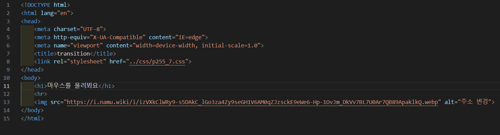
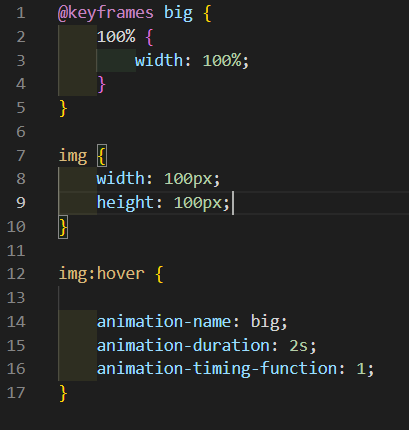
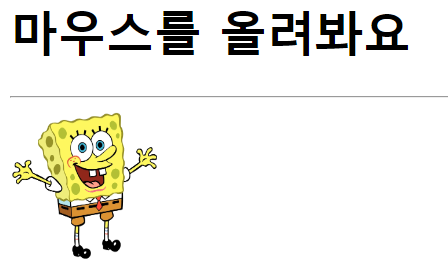
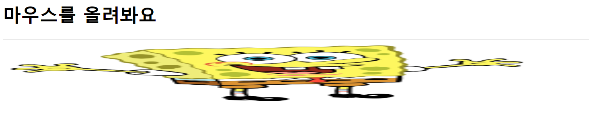

# 255페이지 실습문제 7번 문제

-----------------------------

## 웹페이지의 구성

> 문제에서 요구하는 웹페이지는 다음 조건을 만족해야 합니다.

+ 이미지에 마우스를 올리면 이미지의 폭이 2초에 걸쳐 부드럽게 브라우저 폭의 크기로 늘어나야함

## 이미지 너비 조정 애니메이션

-----------------------------

> 이미지의 애니메이션 구현을 위해 @keyframe 에서 big 이라는 회전 로직을 생성하고, 100% 일때, width가 100%가 되게끔 합니다.
> 그리고 이미지에 마우스를 올릴 때 이벤트가 발생하므로, img:hover 에서 animation-name을 big 으로 설정하고, animation-duration을 2s로 설정하여 2초동안 애니메이션이 지속되게 합니다. 그리고, animation-timing-function을 1로 설정하여 처음부터 끝까지 일정한 속도를 유지하게 하여 부드럽게 합니다.

## 완성된 웹페이지와 코드

-----------------------------

> 다음은 완성된 웹페이지 사진과 코드 사진입니다.

