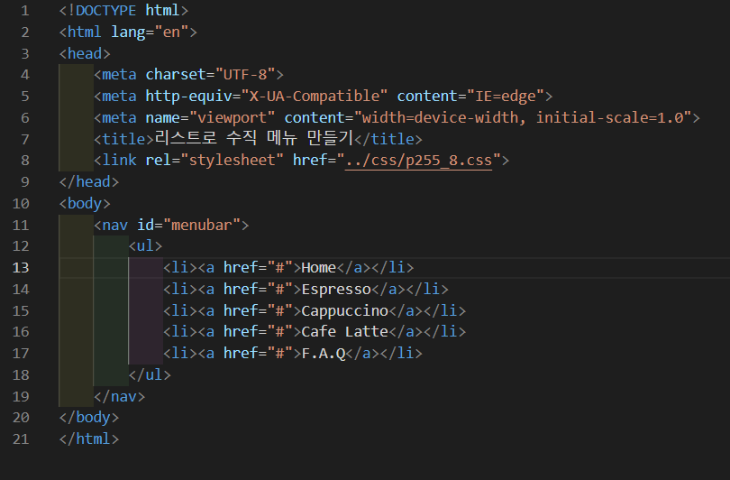
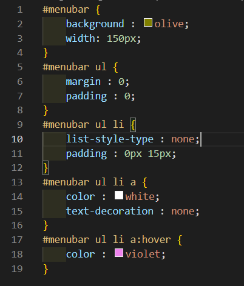

# 255페이지 실습문제 8번 문제

-----------------------------

## 웹페이지의 구성

> 문제에서 요구하는 웹페이지는 다음 조건을 만족해야 합니다.

+ 상하로 출력되는 리스트

## 상하로 출력되는 리스트

-----------------------------

> 상하로 출력되게 끔 하기위해 menubar id를 가지는 태그의 자손 태그인 ul의 자손 태그인 li에서 display : inline-block을 지워줍니다. 그리고 menubar id를 가지는 태그의 width를 150px로 설정하여 리스트들이 다 보이게 합니다.

## 완성된 웹페이지와 코드

-----------------------------

> 다음은 완성된 웹페이지 사진과 코드 사진입니다.

