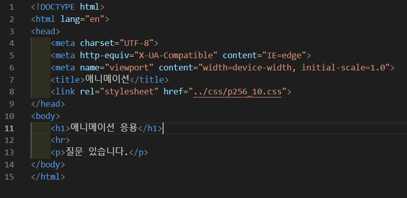
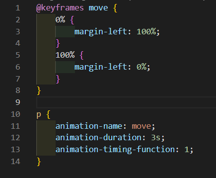

# 256페이지 실습문제 10번 문제

-----------------------------

## 웹페이지의 구성

> 문제에서 요구하는 웹페이지는 다음 조건을 만족해야 합니다.

+ p 문단의 텍스트가 오른쪽 끝에서 부터 왼쪽으로 3초에 걸쳐서 펼쳐지는 애니메이션 구현. 단, 1회만 수행

## p문단 이동 애니메이션

-----------------------------

> 이동 애니메이션을 만들기 위해 @keyframes에서 move 라는 이동 로직을 만들고, 0% 일때, margin-left를 100%로 하고, 100% 일때, margin-left를 0%로 합니다.
> p 태그의 스타일 속성에서 animation-name 속성을 move로 설정하고, animation-duration 속성을 3s로 설정하여 3초간 수행하게 합니다. 그리고, animation-timing-function을 1로 설정하여 부드럽게 수행하게 합니다.

## 완성된 웹페이지와 코드

-----------------------------

> 다음은 완성된 웹페이지 사진과 코드 사진입니다.

