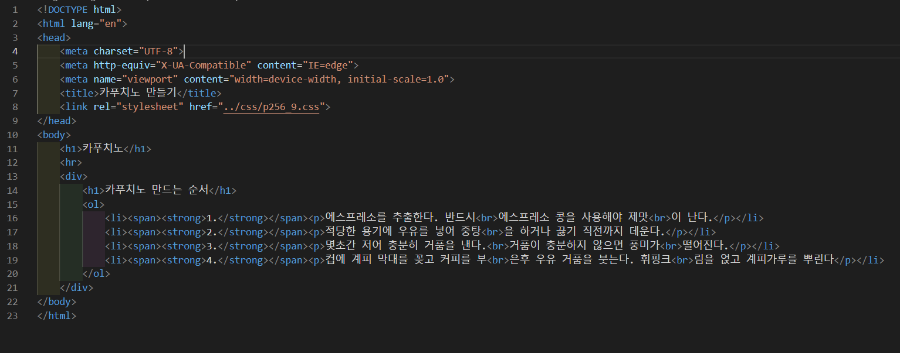
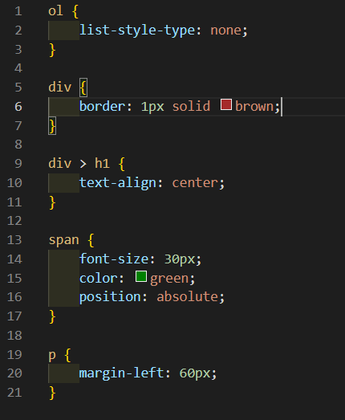
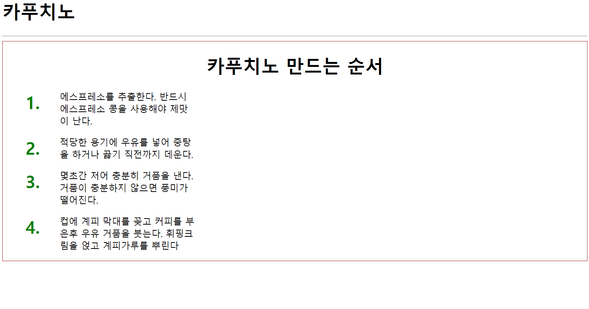

# 256페이지 실습문제 9번 문제

-----------------------------

## 웹페이지의 구성

> 문제에서 요구하는 웹페이지는 다음 조건을 만족해야 합니다. 

+ ol 태그를 사용하여 리스트 생성. 단, 마커를 제거하고 예제와 같은 웹페이지 구현

## ol 태그를 사용하여 리스트 생성

-----------------------------

> 문제의 조건에 맞게 생성을 위해 ol>li*4 를 통해 틀을 생성 후, 내용을 작성합니다.
> div 태그 안에 있는 제목을 중간으로 설정하기 위해 div > h1 에서 text-align을 center로 설정합니다.
> 제목과 리스트를 포함하여 테두리를 생성하기 위해 div 태그의 스타일 속성에서 border 속성을 1px solid brown 으로 설정합니다.
> 숫자를 크게 만들게 하기 위해 span 태그의 스타일 속성에서 font-size를 30px로 설정하고, color를 green으로 설정한 후, position을 absolute로 설정하여 li를 기준으로 위치하게 합니다.
> p 태그의 스타일 속성에서 margin-left를 60px로 설정하여 예제와 비슷하게 출력합니다.

## 완성된 웹페이지와 코드

-----------------------------

> 다음은 완성된 웹페이지 사진과 코드 사진입니다.

