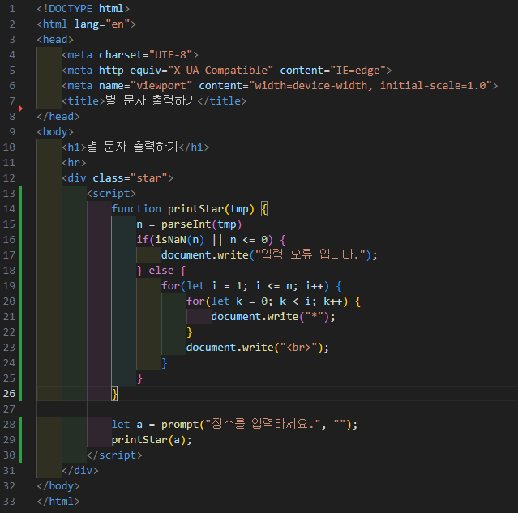

# 303페이지 OpenChallenge 06번 문제

-----------------------------

## 웹페이지의 구성

> 문제에서 제시한 조건은 다음과 같습니다.

+ printStar()의 별 출력 함수 생성
+ 양의 정수가 입력되지 않을 경우, "입력 오류입니다." 출력

## 함수 생성

-----------------------------

> 입력받은 값을 토대로 이중 for문을 돌며 document.write()를 통해 별의 개행태그를 출력하게끔 구현했습니다.

## 입력 오류 처리

-----------------------------

> prompt()를 통해 입력받은 값을 parseInt() 함수로 정수로 변환합니다. (이 과정에서 실수는 정수로 변환됩니다.)
> isNaN() 함수를 사용하여 정수로 변환되었는지 확인합니다. (isNaN()의 리턴이 True 라면 문자열의 입력.)
> 추가로 조건에 변환한 정수값이 0보다 작거나 같을 때 또한 입력 오류를 출력합니다. (양의 정수여야 하므로.)

## 완성된 웹페이지와 코드

-----------------------------

> 다음은 완성된 웹페이지 사진과 코드 사진입니다.

