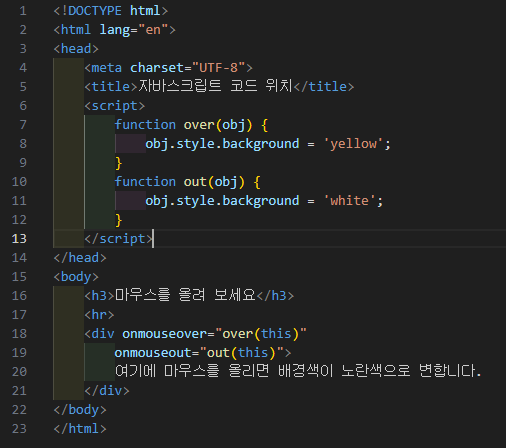
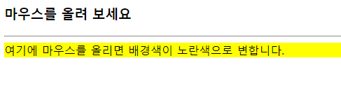
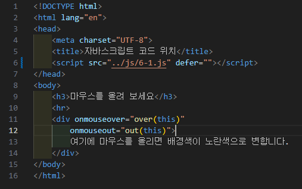
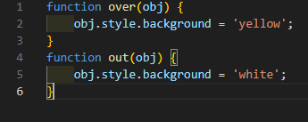

# 307페이지 실습문제 1번 문제

-----------------------------

## 1-1번 문제

-----------------------------

### 웹페이지의 구성

> 문제에서 요구한 웹페이지는 다음 조건을 만족해야합니다.

+ 예제 사진으로 주어진 HTML 페이지를 수정하여 자바스크립트 코드를 script 태그에 삽입

### 자바스크립트 코드를 태그에 삽입

-----------------------------

> head 태그 안에서 script 태그를 생성 후, over 함수와 out 함수를 만들어 마우스가 올라갔을 때, 마우스가 나갔을 때를 따로 구현했습니다.

### 완성된 웹페이지와 코드

-----------------------------

> 다음은 완성된 웹페이지 사진과 코드 사진입니다.

## 1-2번 문제

-----------------------------

### 웹페이지의 구성

> 문제에서 요구한 웹페이지는 다음 조건을 만족해야합니다.

+ 자바스크립트 코드를 6-1.js 파일에 저장하고 script 태그로 6-1.js 파일을 불러오게 끔 HTML 페이지를 수정

### js파일을 불러오게끔 설정

-----------------------------

> 6-1.js 파일을 만들어 1-1번 문제에서 작성한 script 태그 부분의 내용을 6-1.js 에 옮기고, html 파일에서 script의 src 속성을 6-1.js로 연결시켜 실행시켰습니다.

### 완성된 웹페이지와 코드

-----------------------------

> 다음은 완성된 웹페이지 사진과 코드 사진입니다.

