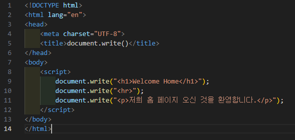

# 307페이지 실습문제 2번 문제

-----------------------------

## 웹페이지의 구성

> 문제에서 요구한 웹페이지는 다음 조건을 만족해야합니다.

+ document.write()를 활용하여 예제와 같은 페이지 작성

## document.write()를 활용하여 HTML 작성

-----------------------------

> body 태그 안에서 script 태그를 사용해서 자바스크립트 문을 작성할 수 있게끔 합니다.
> document.write() 함수를 통해 각 요소의 태그와 내용을 작성하여 출력했습니다.

## 완성된 웹페이지와 코드

-----------------------------

> 다음은 완성된 웹페이지 사진과 코드 사진입니다.

