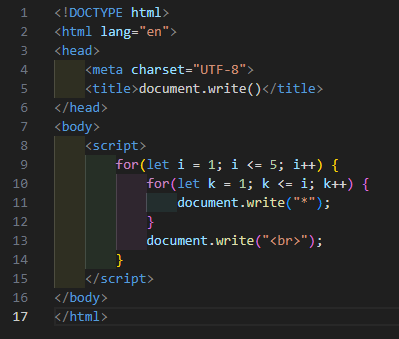
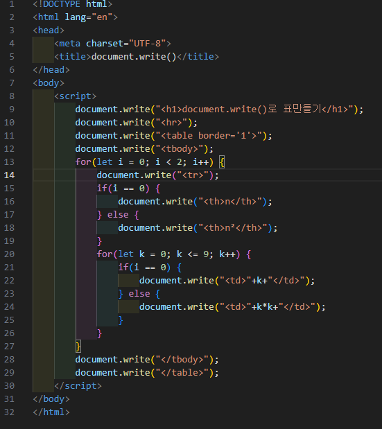
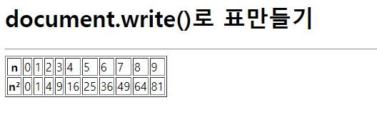

# 308페이지 실습문제 3번 문제

-----------------------------

## 3-1번 문제

-----------------------------

### 웹페이지의 구성

> 문제에서 요구한 웹페이지는 다음 조건을 만족해야합니다.

+ 문제 2에서 주어진 HTML 페이지에 document.write()를 이용하여 예제와 같은 페이지 출력

### document.write()를 이용한 페이지 작성

-----------------------------

> 문제 2에서 주어진 HTML 파일에서 예제처럼 별이 1개부터 5개까지 순차적으로 증가하는 피라미드 모양을 출력하기 위해 for문을 통해 document.write("*")을 사용했습니다.

### 완성된 웹페이지와 코드

-----------------------------

> 다음은 완성된 웹페이지 사진과 코드 사진입니다.

## 3-2번 문제

-----------------------------

### 웹페이지의 구성

> 문제에서 요구한 웹페이지는 다음 조건을 만족해야합니다.

+ 문제 2에서 주어진 HTML 페이지에 document.write()를 이용하여 예제와 같은 페이지 출력

### document.write()를 이용한 페이지 작성

-----------------------------

> 문제 2에서 주어진 HTML 파일에서 script 태그 안에 for문과 document.write()를 이용하여 반복문으로 테이블을 작성했습니다.

### 완성된 웹페이지와 코드

-----------------------------

> 다음은 완성된 웹페이지 사진과 코드 사진입니다.

