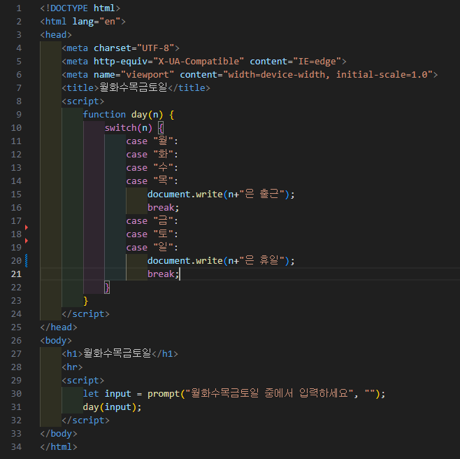

# 308페이지 실습문제 4번 문제

-----------------------------

## 웹페이지의 구성

> 문제에서 요구한 웹페이지는 다음 조건을 만족해야합니다.

+ prompt()를 이용하여 입력을 받아 조건에 맞게 HTML 작성

## prompt()로 값 입력 및 웹페이지 작성

-----------------------------

> prompt()를 통해 값을 입력받아 함수 day()에 파라미터로 전달합니다.
> day 함수에서는 switch, case 문을 통해 월~목과 금~일 을 가려내어 출력을 다르게 합니다.

## 완성된 웹페이지와 코드

-----------------------------

> 다음은 완성된 웹페이지 사진과 코드 사진입니다.

