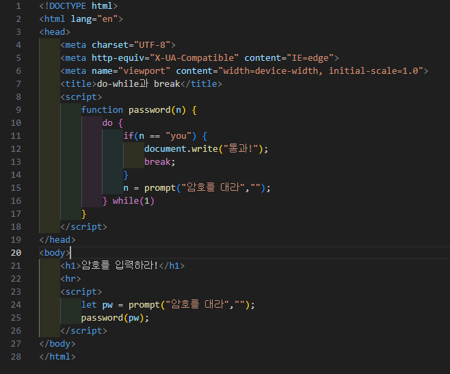

# 308페이지 실습문제 5번 문제

-----------------------------

## 웹페이지의 구성

> 문제에서 요구하는 웹페이지는 다음 조건을 만족해야합니다.

+ 정확한 입력값이 들어올 때 까지 prompt()의 반복

## 정확한 입력값이 들어올 때 까지 prompt()의 반복

-----------------------------

> 먼저 값을 입력받고 입력받은 값을 password() 함수에 파라미터로 전달합니다.
> password 함수는 전달받은 값이 you 인지 확인하고 아니라면 입력을 받는 do - while 문을 실행합니다.

## 완성된 웹페이지와 코드

-----------------------------

> 다음은 완성된 웹페이지 사진과 코드 사진입니다.

