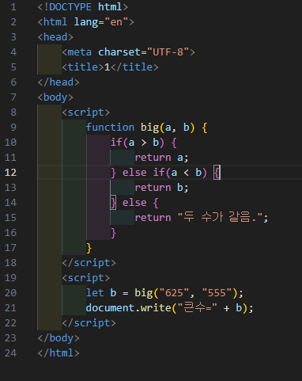
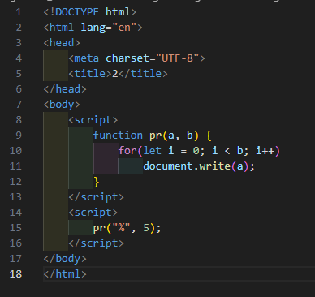

# 309페이지 실습문제 6번 문제

-----------------------------

## 6-1번 문제

-----------------------------

### 웹페이지의 구성

> 문제에서 요구한 웹페이지는 다음 조건을 만족해야합니다.

+ 예제에 주어진 HTML 파일에서 사용된 함수를 작성

### 함수 작성

-----------------------------

> HTML 파일에서 작성된 big 함수를 작성해야하는 문제입니다.
> 파라미터로 전달받은 두 값 중 더 큰 값을 출력하는 문제로 big 함수 안에서 값 비교를 하는 조건문을 작성해서 해결했습니다.

### 완성된 웹페이지와 코드

-----------------------------

> 다음은 완성된 웹페이지 사진과 코드 사진입니다.

## 6-2번 문제

-----------------------------

### 웹페이지의 구성

> 문제에서 요구한 웹페이지는 다음 조건을 만족해야합니다.

+ 예제에 주어진 HTML 파일에서 사용된 함수를 작성

### 함수 작성

-----------------------------

> HTML 파일에서 작성된 pr 함수를 작성해야하는 문제입니다.
> 파라미터로 문자와 정수를 전달받아, 문자를 정수만큼 출력하는 문제로, pr 함수에서 반복문의 조건을 전달받은 정수 만큼 돌게 지정하여 해결했습니다.

### 완성된 웹페이지와 코드

-----------------------------

> 다음은 완성된 웹페이지 사진과 코드 사진입니다.

