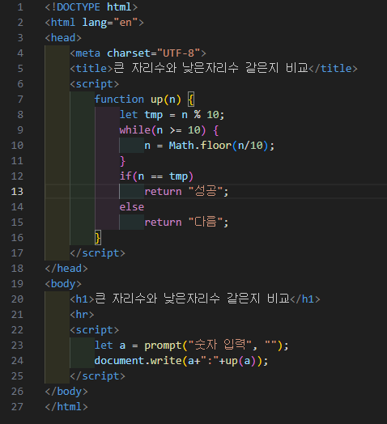

# 309페이지 실습문제 7번 문제

-----------------------------

## 웹페이지의 구성

> 문제에서 요구한 웹페이지는 다음 조건을 만족해야합니다.

+ 숫자를 입력받고, 가장 큰 자리 수와 가장 낮은 자리 수를 비교하여 출력

## 가장 큰자리수와 가장 낮은자리수 비교

-----------------------------

> 문제에서 추가로 문자열 연산을 사용하지 않고 while을 이용하여 구하라는 조건이 붙습니다.
> 가장 낮은 자리수는 입력받은 값을 10으로 나눈 나머지로 구하고, 가장 높은 자리수는 입력값이 한 자리수가 될때까지 while문을 통해 10으로 나누어주고, 바닥 연산으로 나머지를 버려줍니다.
> 이를 통해, 조건문에서 가장 높은 자리수와 가장 낮은 자리수를 비교하여 조건대로 출력합니다.

## 완성된 웹페이지와 코드

-----------------------------

> 다음은 완성된 웹페이지 사진과 코드 사진입니다.

