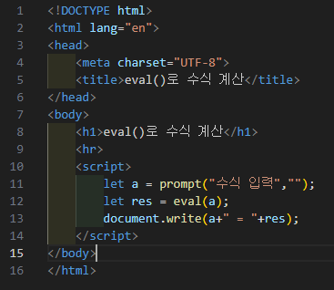
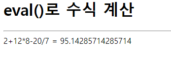

# 310페이지 실습문제 8번

-----------------------------

## 웹페이지의 구성

> 문제에서 요구한 웹페이지는 다음 조건을 만족해야합니다.

+ 수식을 입력받아 eval() 함수를 이용하여 계산 결과를 출력

## eval() 함수로 계산하여 출력

-----------------------------

> prompt() 함수를 통해 수식을 입력받고, 입력받은 수식을 eval() 함수에 파라미터로 전달하여 값을 출력합니다.

## 완성된 웹페이지와 코드

-----------------------------

> 다음은 완성된 웹페이지 사진과 코드 사진입니다.

-----------------------------

