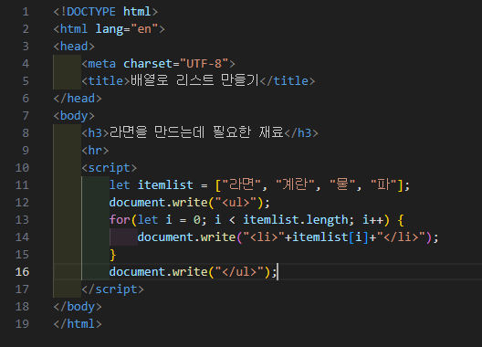
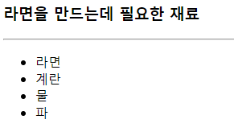

# 340페이지 OpenChallenge 07번 문제

-----------------------------

## 웹페이지의 구성

> 문제에서 요구한 웹페이지는 다음 조건을 만족해야합니다.

+ 문제에서 주어진 리스트를 예제처럼 출력

## 배열의 출력

-----------------------------

> 문제에서 아이템들이 배열로 주어졌으므로, 반복문을 통해 각 원소에 접근하여 document.write() 함수에 파라미터로 각각 전달합니다.

## 완성된 웹페이지와 코드

-----------------------------

> 다음은 완성된 웹페이지 사진과 코드 사진입니다.

