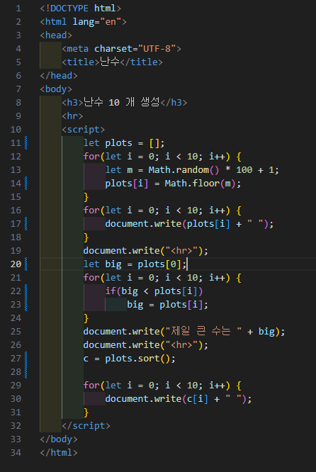
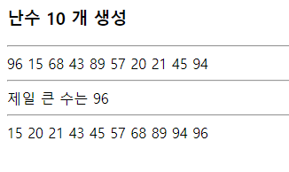

# 343페이지 실습문제 1번 문제

-----------------------------

## 웹페이지의 구성

> 문제에서 요구한 웹페이지는 다음 조건을 만족해야합니다.

+ 난수 10개를 생성하여 plots 배열에 저장
+ 배열에 저장된 가장 큰 수 출력

## 난수 생성 및 배열에 저장

-----------------------------

> 1~100 사이의 난수 10개를 생성해야 하므로, 반복문에서 Math.random() * 100 + 1 을 통해 1~100 사이의 난수를 받아 각 배열의 인덱스위치에 저장합니다.

## 배열에 저장된 가장 큰 수 출력

-----------------------------

> 배열의 첫번째 값이 가장 크다고 가정하고, 반복문을 돌며 모든 값과 비교해서 큰값을 찾아내서 출력합니다.

## 완성된 웹페이지와 코드

-----------------------------

> 다음은 완성된 웹페이지 사진과 코드 사진입니다.

