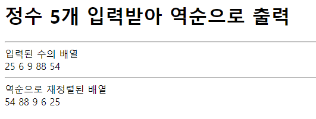

# 344페이지 실습문제 2번 문제

-----------------------------

## 웹페이지의 구성

> 문제에서 요구하는 웹페이지는 다음 조건을 만족해야합니다.

+ 5개의 정수를 입력받아 입력된 반대 순으로 출력

## 입력 반대 순으로 출력

-----------------------------

> 입력된 수들은 배열에 차례대로 저장되었으므로, 반대 출력은 for문을 4부터 0까지 내려가는 조건으로 작성하게 되면 역순 출력이 가능해집니다.

## 완성된 웹페이지와 코드

-----------------------------

> 다음은 완성된 웹페이지 사진과 코드 사진입니다.

