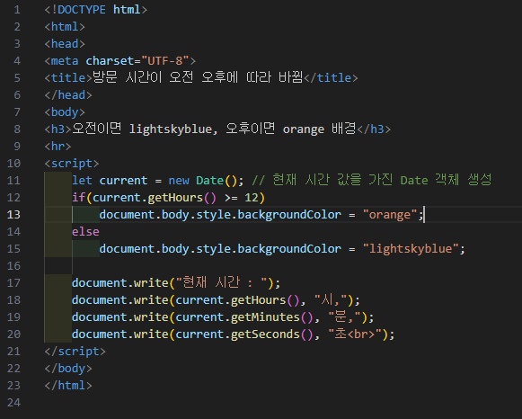
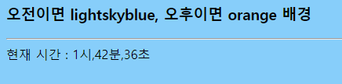

# 344페이지 실습문제 3번 문제

-----------------------------

## 웹페이지의 구성

> 문제에서 요구하는 웹페이지는 다음 조건을 만족해야합니다.

+ 오전일때 배경색이 lightskyblue, 오후일때 배경색이 orange로 출력

## 시간별 배경색 변경

-----------------------------

> 먼저 오전, 오후를 판별하기 위해 Date 객체를 생성합니다.
> 현재 시(Hour)를 가져와서 12 이전이라면, 배경색을 lightskyblue로, 12 이상이라면 배경색을 orange로 설정합니다.

## 완성된 웹페이지와 코드

-----------------------------

> 다음은 완성된 웹페이지 사진과 코드 사진입니다.

