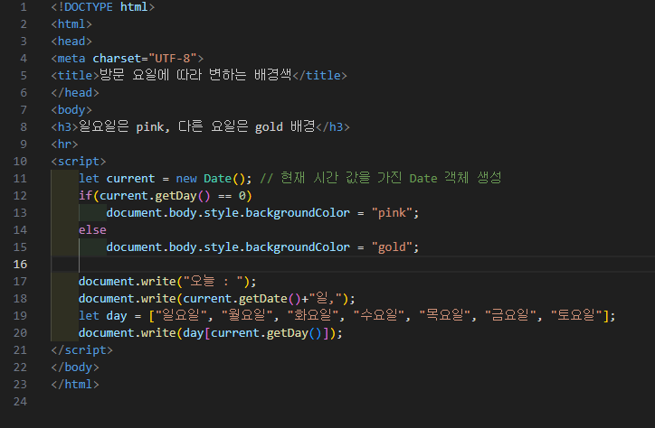
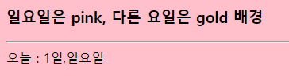

# 344페이지 실습문제 4번 문제

-----------------------------

## 웹페이지의 구성

> 문제에서 요구하는 웹페이지는 다음 조건을 만족해야합니다.

+ 요일이 월~토라면 배경색을 gold로, 일요일이면 pink로 출력

## 요일별 배경색 변경

-----------------------------

> 요일을 가져오기 위해 Date 객체를 생성합니다.
> getDay() 함수를 호출하여 요일값을 가져옵니다. (0~6 까지 순서대로 일~토)
> 요일값에 맞게 배경색을 설정해줍니다.

## 완성된 웹페이지와 코드

-----------------------------

> 다음은 완성된 웹페이지 사진과 코드 사진입니다.

