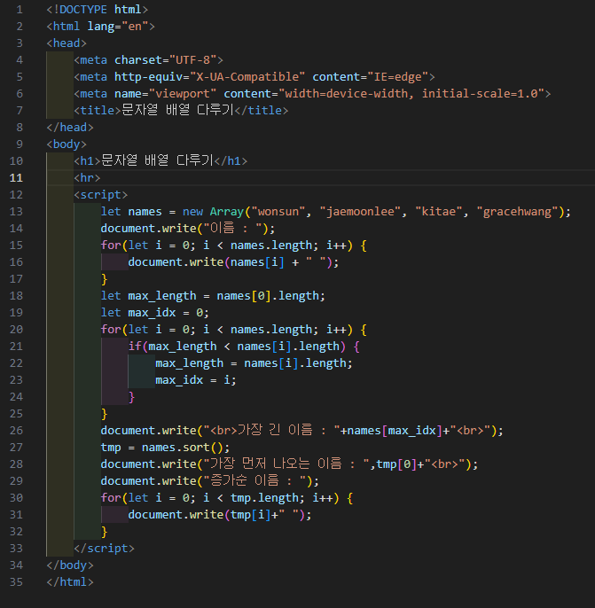
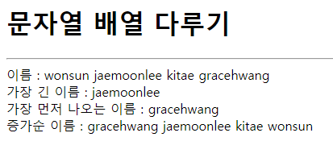

# 345페이지 실습문제 5번 문제

-----------------------------

## 웹페이지의 구성

> 문제에서 요구하는 웹페이지는 다음 조건을 만족해야합니다.

+ names 배열에 들어있는 각 이름을 출력
+ names 배열에서 가장 긴 이름 출력
+ names 배열에서 사전순으로 가장 먼저 나오는 이름 출력
+ names 배열을 증가순(사전순)으로 재정렬하여 출력

## names 배열에 들어있는 각 이름을 출력

-----------------------------

> names 배열을 for문으로 각 인덱스에 접근하여 document.write() 함수를 통해 출력합니다.

## names 배열에서 가장 긴 이름 출력

-----------------------------

> names[0]의 길이가 가장 긴 이름이라고 가정하고 for문안에서 모든 이름들과 비교하여 가장 긴 이름을 가진 배열의 인덱스를 찾아 해당 인덱스의 이름을 출력합니다.

## names 배열에서 사전순으로 가장 먼저 나오는 이름 출력

-----------------------------

> names.sort() 함수를 사용하여 배열의 내용을 사전순으로 정렬합니다.
> 이때, 가장 먼저 나오는 이름은 0번째에 있으므로 0번째를 출력합니다.

## names 배열을 증가순으로 재정렬하여 출력

-----------------------------

> names.sort()로 정렬된 배열을 그대로 출력하면 사전순으로 출력됩니다.

## 완성된 웹페이지와 코드

-----------------------------

> 다음은 완성된 웹페이지 사진과 코드 사진입니다.

