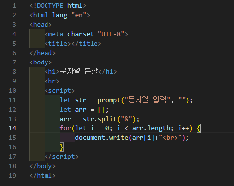
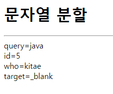

# 345페이지 실습문제 6번 문제

-----------------------------

## 웹페이지의 구성

> 문제에서 요구하는 웹페이지는 다음 조건을 만족해야합니다.

+ 입력받은 문자열을 & 문자 기준으로 분할하여 출력

## 문자열 분할

-----------------------------

> 입력받은 문자열을 split()을 통해 분할하여 새로운 배열에 담아 출력합니다.

## 완성된 웹페이지와 코드

-----------------------------

> 다음은 완성된 웹페이지 사진과 코드 사진입니다.

