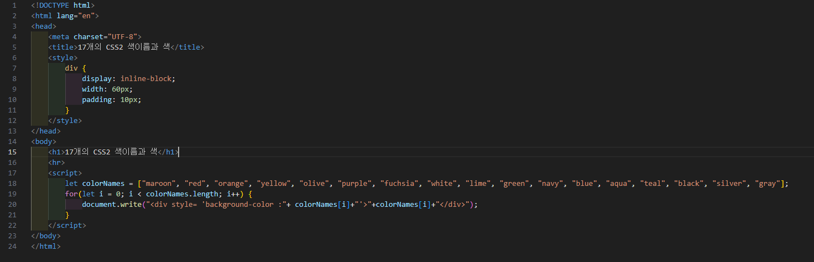
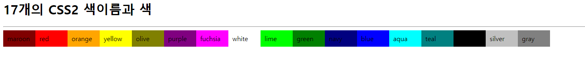

# 346페이지 실습문제 7번 문제

-----------------------------

## 웹페이지의 구성

> 문제에서 요구하는 웹페이지는 다음 조건을 만족해야합니다.

+ 색이름을 가진 문자열 배열에서 각 값을 출력하고 색상은 해당 색으로 설정

## 색상 설정 및 출력

-----------------------------

> 각 문자열이 가리키는 색상으로 div 태그를 색칠하기 위해 for문을 돌며 div style 속성을 각각 설정해줍니다.

## 완성된 웹페이지와 코드

-----------------------------

> 다음은 완성된 웹페이지 사진과 코드 사진입니다.

