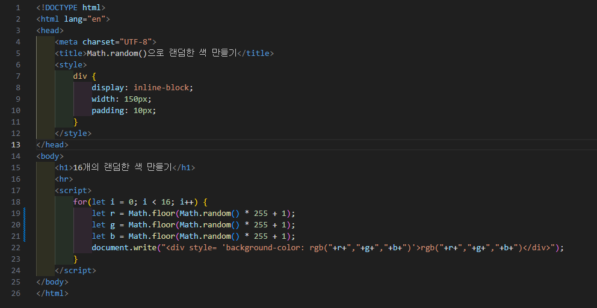
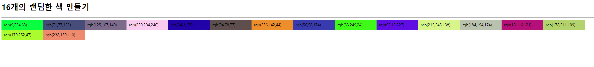

# 346페이지 실습문제 8번 문제

-----------------------------

## 웹페이지의 구성

> 문제에서 요구하는 웹페이지는 다음 조건을 만족해야합니다.

+ rgb값을 난수로 받아 해당 rgb값으로 색칠하고 값을 출력

## 난수 rgb 설정

-----------------------------

> 각 div 블록마다 rgb 값을 난수로 설정하여 출력해야하기 때문에, for문에서 r값, g값, b값을 전부 Math.random() * 255 + 1로 설정하여 난수로 출력되게 합니다.
> 각 값을 7번 문제와 동일하게 div style 속성에 background-color 값으로 설정하고 출력합니다.

## 완성된 웹페이지와 코드

-----------------------------

> 다음은 완성된 웹페이지 사진과 코드 사진입니다.

