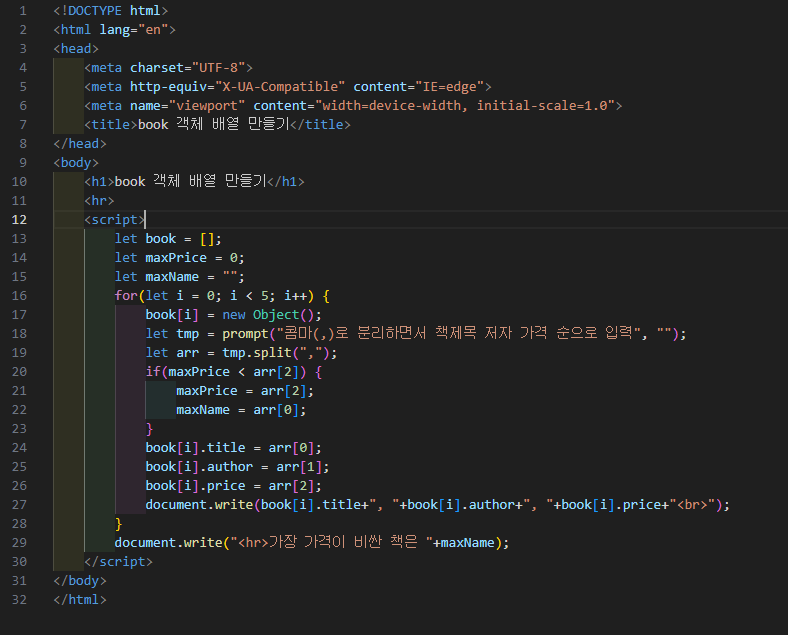
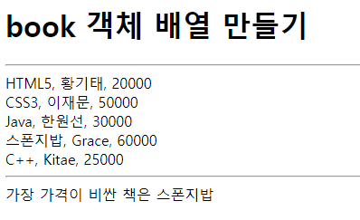

# 347페이지 실습문제 10번 문제

-----------------------------

## 웹페이지의 구성

> 문제에서 요구한 웹페이지는 다음 조건을 만족해야합니다.

+ new Object()를 이용해 생성한 book 객체 배열을 생성하고 5권의 책정보를 입력받아 출력 후, 가장 비싼 책을 다음으로 출력
+ 콤마로 입력값을 분리

## 객체 배열 생성

-----------------------------

> 5권의 책을 입력받으므로, for문을 통해 책 정보를 입력받습니다. 1번 반복할 때 마다 배열에 book 객체를 새로 생성하여 담습니다.
> 해당 인덱스의 book 객체의 프로퍼티를 입력값을 통해 초기화합니다.
> 가장 비싼 책을 찾아내기 위해 0번째 객체가 가장 비싸다고 가정하고 모든 객체에 접근하며 제일 비싼 책의 이름을 저장합니다.

## 콤마로 입력값 분리

-----------------------------

> prompt()를 통해 입력받은 값들을 split()을 통해 콤마(,) 로 분리하여 프로퍼티에 초기화합니다.

## 완성된 웹페이지와 코드

-----------------------------

> 다음은 완성된 웹페이지 사진과 코드 사진입니다.

